<!-- SPDX-FileCopyrightText: Copyright 2026 <balparda@github.com> & <BellaKeri@github.com> -->
<!-- SPDX-License-Identifier: Apache-2.0 -->
# tranZoom

Fractal manipulation with LLMs

- **Primary use case:** Render ultra-deep [Mandelbrot Set](https://en.wikipedia.org/wiki/Mandelbrot_set) and [Julia Set](https://en.wikipedia.org/wiki/Julia_set) fractal images with arbitrary precision and use AI/LLMs to guide fractal zoom sequences
- **Works with:** Local filesystem (PNG output), complex-plane coordinates, local LLM vision models (via LMStudio + `transai`)
- **Status:** Early / experimental — core fractal engine is functional; AI-guided zoom is functional
- **License:** Apache-2.0

**tranZoom** is a Python CLI tool for rendering the Mandelbrot set and Julia Sets at virtually unlimited zoom depth using arbitrary-precision arithmetic (`gmpy2`), and for navigating fractals using AI. The goal is to be able to zoom so deep that standard double-precision floating point becomes meaningless — tranZoom automatically computes the required precision and renders faithfully at any scale. The `tranz zoom ai` command uses local LLM vision models (via `transai` / LMStudio) to evaluate each rendered frame, score nine sectors for visual interest, and autonomously navigate toward the most promising region of the fractal.

Since version 1.0.0 it is a PyPI package: <https://pypi.org/project/tranzoom/>

Built with:

- **Python 3.12+** with **Poetry** for dependency management
- **gmpy2** for arbitrary-precision (`mpq`/`mpfr`) complex-plane arithmetic
- **Pillow** for PNG image output
- **imageio** + **imageio-ffmpeg** + **numpy** for GIF and MP4 animation export
- **tqdm** for progress bars during rendering
- **transai** for AI/LLM integration (LMStudio vision models)
- **Typer** + **Rich** for the CLI and terminal output
- **Transcrypto** for CLI boilerplate, logging, hashing, and config management
- **Ruff**, **MyPy**, **Pyright**, **typeguard**, **pre-commit**, **GitHub Actions** for quality and CI

## Table of contents

- [tranZoom](#tranzoom)
  - [Table of contents](#table-of-contents)
  - [License](#license)
    - [Third-party notices](#third-party-notices)
    - [Contributions and inbound licensing](#contributions-and-inbound-licensing)
  - [Installation](#installation)
    - [Supported platforms](#supported-platforms)
    - [Known dependencies (Prerequisites)](#known-dependencies-prerequisites)
  - [Context / Problem Space](#context--problem-space)
    - [What this tool is](#what-this-tool-is)
    - [What this tool is not](#what-this-tool-is-not)
    - [Key concepts and terminology](#key-concepts-and-terminology)
      - [Frame Representation](#frame-representation)
      - [Computation Parameters](#computation-parameters)
      - [Precision](#precision)
    - [Inputs and outputs](#inputs-and-outputs)
      - [Inputs](#inputs)
      - [Outputs](#outputs)
  - [CLI Interface](#cli-interface)
    - [Quick start](#quick-start)
    - [Palettes](#palettes)
    - [Command structure](#command-structure)
    - [`tranz` global flags](#tranz-global-flags)
    - [`tranz image` subgroup flags](#tranz-image-subgroup-flags)
    - [`tranz zoom` subgroup flags](#tranz-zoom-subgroup-flags)
    - [CLI Commands Documentation](#cli-commands-documentation)
    - [`tranz image mandel` — Render a Mandelbrot image](#tranz-image-mandel--render-a-mandelbrot-image)
    - [`tranz image julia` — Render a Julia Set image](#tranz-image-julia--render-a-julia-set-image)
    - [`tranz image read` — Read a tranZoom image](#tranz-image-read--read-a-tranzoom-image)
    - [`tranz image clean` — Create a clean copy for sharing](#tranz-image-clean--create-a-clean-copy-for-sharing)
    - [`tranz zoom ai` — AI-guided fractal zoom search](#tranz-zoom-ai--ai-guided-fractal-zoom-search)
    - [`tranz zoom manual` — Manually-guided fractal zoom](#tranz-zoom-manual--manually-guided-fractal-zoom)
    - [`tranz zoom auto` — Automated GIF/MP4 zoom animation](#tranz-zoom-auto--automated-gifmp4-zoom-animation)
    - [Comprehensive example images and zooms](#comprehensive-example-images-and-zooms)
      - [Full / Default (×1)](#full--default-1)
        - [Set Interior Coloring](#set-interior-coloring)
      - [Seahorse (×155)](#seahorse-155)
      - [Seahorse Tail (×3k)](#seahorse-tail-3k)
      - [Seahorse Tail Zoom](#seahorse-tail-zoom)
      - [Julia Suzana (×1)](#julia-suzana-1)
      - [Julia Suzana Wave (×427)](#julia-suzana-wave-427)
      - [Powers of 1000](#powers-of-1000)
    - [Configuration](#configuration)
    - [Color and formatting](#color-and-formatting)
    - [Exit codes](#exit-codes)
  - [Project Design](#project-design)
    - [Modules / packages](#modules--packages)
    - [Performance characteristics](#performance-characteristics)
  - [Development Instructions](#development-instructions)
    - [File structure](#file-structure)
    - [Development Setup](#development-setup)
      - [Install Python](#install-python)
      - [Install Poetry (recommended: `pipx`)](#install-poetry-recommended-pipx)
      - [Make sure `.venv` is local](#make-sure-venv-is-local)
      - [Get the repository](#get-the-repository)
      - [Create environment and install dependencies](#create-environment-and-install-dependencies)
      - [Optional: VSCode setup](#optional-vscode-setup)
    - [Build](#build)
    - [Run locally](#run-locally)
    - [Testing](#testing)
      - [Unit tests / Coverage](#unit-tests--coverage)
      - [Instrumenting your code](#instrumenting-your-code)
      - [Integration / e2e tests](#integration--e2e-tests)
    - [Linting / formatting / static analysis](#linting--formatting--static-analysis)
      - [Type checking](#type-checking)
    - [Documentation updates](#documentation-updates)
    - [Versioning and releases](#versioning-and-releases)
      - [Versioning scheme](#versioning-scheme)
      - [Updating versions](#updating-versions)
        - [Bump project version (patch/minor/major)](#bump-project-version-patchminormajor)
        - [Update dependency versions](#update-dependency-versions)
        - [Exporting the `requirements.txt` file](#exporting-the-requirementstxt-file)
        - [CI and docs](#ci-and-docs)
        - [Git tag and commit](#git-tag-and-commit)
        - [Publish to PyPI](#publish-to-pypi)
  - [Security](#security)
  - [Troubleshooting](#troubleshooting)
    - [Enable debug output](#enable-debug-output)
    - [`gmpy2` installation issues](#gmpy2-installation-issues)
    - [Rendering is very slow](#rendering-is-very-slow)

## License

Copyright 2026 Daniel Balparda <balparda@github.com> & Bella Keri <BellaKeri@github.com>

Licensed under the **Apache License, Version 2.0** (the "License"); you may not use this file except in compliance with the License. You may obtain a [copy of the License here](http://www.apache.org/licenses/LICENSE-2.0).

Unless required by applicable law or agreed to in writing, software distributed under the License is distributed on an "AS IS" BASIS, WITHOUT WARRANTIES OR CONDITIONS OF ANY KIND, either express or implied. See the License for the specific language governing permissions and limitations under the License.

### Third-party notices

This project includes or depends on third-party software (see `requirements.txt` and `pyproject.toml`). Key dependencies include:

- [gmpy2](https://gmpy2.readthedocs.io/) — Apache-2.0 compatible
- [Pillow](https://python-pillow.github.io/) — HPND license
- [tqdm](https://github.com/tqdm/tqdm) — MPL-2.0 / MIT
- [pydantic](https://docs.pydantic.dev/) — MIT
- [transai](https://github.com/balparda/transai) — Apache-2.0
- [transcrypto](https://github.com/balparda/transcrypto) — Apache-2.0

### Contributions and inbound licensing

Contributions are accepted under the Apache-2.0 license (same as project).

## Installation

To install from PyPI:

```sh
pip3 install tranzoom
```

Or install from the repository for development (see [Development Setup](#development-setup)).

### Supported platforms

- OS: Linux, macOS
- Architectures: x86_64, arm64
- Python: 3.12, 3.13, 3.14

### Known dependencies (Prerequisites)

- **[python 3.12+](https://python.org/)** — [documentation](https://docs.python.org/3.12/)
- **[gmpy2 2.3+](https://pypi.org/project/gmpy2/)** — Arbitrary-precision arithmetic using GMP/MPFR/MPC — [documentation](https://gmpy2.readthedocs.io/en/latest/)
- **[Pillow 12.2+](https://pypi.org/project/Pillow/)** — PNG image generation — [documentation](https://pillow.readthedocs.io/)
- **[imageio 2.37+](https://pypi.org/project/imageio/)** — GIF and image sequence I/O — [documentation](https://imageio.readthedocs.io/)
- **[imageio-ffmpeg 0.6+](https://pypi.org/project/imageio-ffmpeg/)** — MP4 video export via FFmpeg — [documentation](https://github.com/imageio/imageio-ffmpeg)
- **[numpy 2.4+](https://pypi.org/project/numpy/)** — Array operations for animation frame conversion — [documentation](https://numpy.org/doc/)
- **[tqdm 4.67+](https://pypi.org/project/tqdm/)** — Progress bars — [documentation](https://tqdm.github.io/)
- **[rich 15.0+](https://pypi.org/project/rich/)** — Terminal formatting — [documentation](https://rich.readthedocs.io/en/latest/)
- **[typer 0.25+](https://pypi.org/project/typer/)** — CLI parser — [documentation](https://typer.tiangolo.com/)
- **[transai 1.3+](https://pypi.org/project/transai/)** — AI/LLM integration (LMStudio vision models) — [documentation](https://github.com/balparda/transai)
- **[transcrypto 2.6.1+](https://pypi.org/project/transcrypto/)** — CLI utilities, logging, hashing, config — [documentation](https://github.com/balparda/transcrypto)

## Context / Problem Space

### What this tool is

tranZoom is a command-line fractal renderer focused on extreme zoom depth for [Mandelbrot Set](https://en.wikipedia.org/wiki/Mandelbrot_set) and [Julia Set](https://en.wikipedia.org/wiki/Julia_set). Standard double-precision (`float64`) floating point has only about 15–16 significant decimal digits, so any zoom below roughly 1e-14 of the full Mandelbrot set will produce incorrect images due to precision loss. tranZoom uses `gmpy2.mpq` (exact rational arithmetic) to represent frame coordinates and `gmpy2.mpfr` (arbitrary-precision floating point) for the escape-time computations, automatically determining how many bits of precision are needed for any given zoom level. Starting with version 1.3.0, tranZoom also renders Julia Sets — the same arbitrary-precision engine works for any complex-constant Julia iteration.

Starting with version 1.1.0, tranZoom can use local LLM vision models to autonomously guide the zoom — identifying visually interesting regions, scoring nine sectors of the current frame, and navigating toward the most promising sector at each step. A manual mode is also available for human-guided zoom sessions with the same iterative frame navigation. Both AI and manual zoom support Mandelbrot and Julia Sets.

Starting with version 1.4.0, tranZoom can render animated GIF and MP4 zoom animations with the `tranz zoom auto` command — a straight zoom-in path toward any target frame, with configurable frame count, FPS, and duration.

Starting with version 1.5.0, the fractal renderer uses **smooth coloring**: each exterior pixel stores both an integer escape count `n` and a fractional value `nu ∈ [0, 1)` derived from the normalized iteration count formula, packed into 8 bytes per pixel. This eliminates discrete color bands and produces smooth gradients at all zoom depths. The database now caches both the raw computed pixel data and the rendered PNGs, so revisiting a frame or re-rendering with a new palette is fast — the expensive fractal computation is only performed once.

Starting with version 1.6.1, tranZoom estimates file sizes and memory requirements before starting any expensive operation and warns when estimates exceed configurable thresholds (50 MB for a single image, 2 GB for an animation, 20 GB RAM for a single image render, 32 GB RAM for a full animation render). The `tranz zoom auto` command now streams frames from disk on demand during animation rendering (when the DB is enabled) to reduce peak memory, and periodically checkpoints the DB to protect against data loss during long renders.

The tool can save all computations to a local DB. If allowed, it will use these saved computations to save time in any new computation. This DB can be encrypted.

### What this tool is not

- Not a real-time / interactive fractal explorer (rendering is intentionally CPU-intensive for correctness at depth)
- Not limited to a fixed precision (unlike most other fractal tools, which cap at `float64`)
- Not a cloud-based tool — AI zoom uses local LLM models via LMStudio; no external API calls

### Key concepts and terminology

- **[Frame](#frame-representation)**: A rectangular region of the complex plane, defined by a center + width. Stored as `gmpy2.mpq` (exact rationals) to avoid any accumulation of rounding error in coordinates.
- **[ComputationParameters](#computation-parameters)**: The complete description of a fractal computation: a `Frame`, pixel image dimensions, iteration depth, and (optionally) an interior Set coloring algorithm. Used as the sole input to all rendering functions.
- **RenderParameters**: Defines how a finished computation is transformed into an output image — file type, exterior palette, interior (Set) palette, optional crosshair mark (coordinate, color, width), and optional overlay type. Together with `ComputationParameters`, uniquely identifies a rendered PNG.
- **[Precision](#precision)**: The number of bits of `mpfr` floating-point precision used for escape-time iteration. Computed automatically from the frame geometry, image dimensions, and iteration depth; never needs to be set manually.
- **Magnification**: Ratio of the default full-set frame area to the current frame area. 1× = full set; 1G× = zoomed in one billion times.
- **Escape-time iteration**: The core Mandelbrot test; larger `max_iter` produces more detail at high zoom.
- **Interior tests**: Fast algebraic checks (main cardioid, period-2 bulb) that skip the iterative test for points known to be inside the set, speeding up rendering significantly.
- **Smooth coloring**: Each exterior pixel stores both an integer escape count `n` and a fractional smooth-escape value `nu ∈ [0, 1)` using the normalized iteration count formula. The two values are packed into a single `uint64` (8 bytes per pixel) using `EncodeIntFloatTo64`. Palette mapping uses `(n, nu)` interpolation over the cumulative histogram for smooth, band-free color gradients at all zoom depths.
- **Zoom color normalization**: A `ZoomColorNorm` is built from a set of **marker frames** selected at regular zoom-depth intervals (one per ≈8.5× zoom by default, controlled by `MAGNITUDE_PER_FRAME_MARKER`). Each marker's histogram is used as a color anchor so that the same escape-iteration value maps to a consistent palette position across every frame in an animation, eliminating per-frame color flickering. `ZoomColorNorm.FromSortedMarkers()` constructs the normalizer from a sorted iterable of `(frame_idx, Image)` pairs.
- **Color palette**: Fourteen built-in palettes color the exterior (escaped) pixels. The active palette is chosen with `--palette` (global flag). Positions in the palette are determined by smooth histogram equalization of `(n, nu)` escape values, so the full color range is used regardless of zoom depth or iteration scale. Available palettes: `sahara` (classic 16-stop gradient, default), `lava` (16-stop volcanic gradient), `electric` (32-stop abyss-to-magenta-to-lavender gradient), `sunset` (32-stop indigo-to-amber-to-wine gradient), `aurora` (16-stop night-sky → polar-green aurora → white), `plasma` (16-stop dark void → purple → magenta → white), `forest` (16-stop dark soil → forest green → lime-yellow), `coral` (16-stop deep abyss → teal → coral → pale pink), `gold`, `toxic`, `iris`, `ember`, `rgrayscale` (8-stop white-to-black gradient, designed for interior coloring), `grayscale` (8-stop black-to-white gradient).
- **DB computation and render caching**: The `FractalDatabase` persists the raw computed `Image` data to disk after each fractal render. On subsequent calls with the same frame and computation parameters, the expensive fractal computation is skipped and the cached data is loaded instead. Rendered PNGs are also cached; if a matching PNG file exists on disk, it is returned immediately. Use `--force` to bypass the cache and always recompute.
- **Interior (Set) coloring**: By default, interior points (those that never escape, i.e., inside the Mandelbrot/Julia Set) are rendered as pure black. Passing `--set ALGORITHM` enables smooth coloring of those points using a separate `--set-palette` (default `rgrayscale`); supported algorithms: `min` (minimum `|z|` at max depth), `max` (maximum `|z|`), `angle` (angle of `z`), `imaginary` (imaginary-weighted average of `z`). Histogram equalization is applied over the stored values. The `rgrayscale` set palette goes white (deep interior, low `|z|`) → black (near boundary, high `|z|`), so the Set boundary is always dark for contrast with the exterior colors. Both flags are global and apply to all `image` and `zoom` commands.
- **Zoom animation**: The `tranz zoom auto` command renders a straight zoom-in path from a starting frame down to a target magnification and saves it as an animated GIF or MP4 video. Specify any two of `--frames`, `--fps`, and `--duration` to constrain the third. Use `--anim gif` (default) or `--anim mp4` to select the output format. Rendered zoom animations are cached in the DB; if the same zoom parameters were already rendered and the file is still on disk, the cached file is served immediately.
- **AI zoom session**: The `tranz zoom ai` command starts an iterative loop: render the current frame, draw a 3×3 thirds grid overlay with green sector labels, send the image to a local LLM vision model, parse the 9-sector scoring response, and move the frame center toward the highest-scoring sector. Supports both Mandelbrot (default) and Julia Set fractals via `-f/--fractal`. The optional `--query` flag enables targeted search, blending fractal-quality scores with target-match scores. The loop runs until Ctrl+C or `--max-steps` is reached.
- **Manual zoom session**: The `tranz zoom manual` command runs the same iterative frame navigation but prompts the user for a direction at each step (1–9, numpad layout: 5=center, 8=N, 6=E, etc.) instead of querying an LLM. Supports both Mandelbrot and Julia Set fractals.
- **Sector scoring**: Each sector is scored on a 0–100 scale for `fractal_score` (visual complexity / zoom promise). When targeted search is active, an additional `target_match_score` (also 0–100) is blended in with a configurable weight.
- **Image metadata**: All tranZoom PNG images embed rich metadata (`tranZoom:*` PNG text chunks) including frame coordinates, magnification, palette (`tranZoom:render:palette`), precision, per-pixel statistics (`n:min`, `n:max`, `nu:min`, `nu:max`, histogram summaries), and (for AI/manual sessions) the full LLM evaluation, model parameters, prompts, and zoom step count.

#### Frame Representation

A **Frame** is an exact representation of a rectangular region of the complex plane, it is ***your view*** into a fractal, the viewport, the part of the plane to be computed and transformed into an image or visualization. It can be printed by the CLI like:

- **`[MANDELBROT: (-3/4, 0) ± 5/2]`** A ***square*** Frame, centered on $-3/4+0j$ and with *width* and *height* of $5/2$, `[FRACTAL: (center_re, center_im) ± square_side]`; or
- **`[MANDELBROT: (-3/4, 0) ± (5/2, 5/3)]`** A **rectangular** Frame, centered on $-3/4+0j$ and with *width* of $5/2$ (on the *real* scale) and *height* of $5/3$ (on the *imaginary* scale), `[FRACTAL: (center_re, center_im) ± (width_re, height_im)]`.

Frames are stored as [`gmpy2.mpq` (exact rationals)](https://gmpy2.readthedocs.io/en/latest/mpq.html) to avoid any accumulation of rounding error in coordinates. You can provide a `mpq` to the CLI as:

- **`int`** or **`float`**: for example `"23"` or `"23.98205483423723"`. If the float is given as a string like shown here it will be passed as-is to `mpq` and will be converted to arbitrary precision rational, i.e., whatever size fraction is needed to represent all decimal places you gave.
- **rational** *(recommended)*: for example `" -3/4"` or `"7916615127197/29003906250000"` (note the ***very important*** space before the `-3/4` that allows the string to not be confused with a parameter by the CLI parser).

Here is an example with mixed use:

```txt
" -0.74303" "0.126433" "1611/100000" "0.0176"
will create the Frame:
[MANDELBROT: (-74303/100000, 126433/1000000) ± (1611/100000, 11/625)]
```

Here is one example with numbers that would usually *NOT* be representable with regular `float`:

```txt
" -929554858796448380940239382643467500000001/1250000000000000000000000000000000000000000" "0.13182590420531197049313205638514950000008" "0.00000000000001"
will create the Frame:
[MANDELBROT: (-929554858796448380940239382643467500000001/1250000000000000000000000000000000000000000,
1647823802566399631164150704814368750001/12500000000000000000000000000000000000000) ± 1/100000000000000]
```

Frame will keep these numbers exact always, no matter the precision.

For Julia and other uses the Frame can also receive an extra complex number, a point, determined by real and image parts. It will be represented as:

`[JULIA: (center_re, center_im) ± (width_re, height_im) @ (point_re, point_im)]`

where the `(point_re, point_im)` part is added after an `@`. For example:

`[JULIA: (-3/4, 0) ± (5/2, 5/3) @ (13667/50000, 371/50000)]`

#### Computation Parameters

**`ComputationParameters`** bundles everything that determines a fractal computation: the `Frame` (coordinates), pixel image dimensions (`width` × `height`), iteration depth (`depth`), and an optional interior Set coloring algorithm. It is the sole argument passed to the rendering engine. It can be printed by the CLI like:

- **`{[MANDELBROT: (-3/4, 0) ± 5/2] : [1024, 1024, AUTO]}`** — square Mandelbrot, adaptive depth
- **`{[MANDELBROT: (-3/4, 0) ± 5/2] : [1024, 1024, 50000]}`** — explicit or already computed depth of 50,000
- **`{[JULIA: (-3/4, 0) ± (5/2, 5/3) @ (13667/50000, 371/50000)] : [800, 600, AUTO] : angle}`** — Julia with `angle` Set interior coloring

The format is `{[Frame] : [width, height, depth] : set_algorithm}` where:

- `[Frame]` is the `Frame` string representation described above
- `width` and `height` are the pixel dimensions of the output image
- `depth` is either `AUTO` (meaning the engine will probe for an optimal iteration limit) or an explicit integer from `-i/--iter`
- `set_algorithm` is the interior Set coloring algorithm name (lowercase), only shown when `--set` is given

The `depth=AUTO` sentinel value (`MIN_ITER = 1000`) triggers an adaptive probe: a tiny `16×16` test image is rendered at each candidate depth in `[100k, 1M, 10M]` and the smallest depth where the escape histogram is not saturated is chosen and multiplied by a safety factor. The resolved depth replaces the `AUTO` sentinel before the full render begins, and `ComputationParameters.precision` (and `.context`) always see the final resolved depth.

#### Precision

**Precision** is the number of [MPFR (arbitrary-precision floating-point)](https://www.mpfr.org/) **bits** used during fractal iteration. Mandelbrot computation involves repeated complex-plane arithmetic starting from the frame's coordinates; insufficient floating-point precision causes visible artifacts — pixels classified as escaped or non-escaped incorrectly — especially at high magnification where neighboring pixels differ only in the final bits of their coordinates.

TransZoom computes the required precision automatically for every `(frame, image dimensions, depth)` combination via `ComputationParameters.precision`. You never need to set it manually. The estimate is conservative by design: it aims to keep numerical noise far below one output pixel.

The formula is:

```py
precision = max(P_min, ceil(log2(M / h)) + 2 * ceil(log2(N + 1)) + G)
```

where:

- **`h`** = `min(frame_width / pixel_width, frame_height / pixel_height)` — the smaller complex-plane distance that maps to one output pixel (the tighter precision constraint)
- **`M`** = `max(|top_re|, |bottom_re|, |top_im|, |bottom_im|, 1)` — the largest coordinate magnitude in the frame; because MPFR precision is *relative* (not absolute), frames far from the origin need more bits to represent fine detail at a given scale
- **`N`** — `params.depth`, the iteration ceiling for the render (the resolved depth after any `AUTO` probe); the `2 * ceil(log2(N + 1))` term is an iteration guard that grows logarithmically to account for accumulated rounding error over many iterations
- **`G = 88`** — `_MPFR_MIN_GUARD_BITS`, a fixed safety margin of 88 extra bits beyond the bare minimum to distinguish neighboring pixels
- **`P_min = 140`** — `_MPFR_MIN_PRECISION`, the floor (≈42 decimal digits), active for low-magnification frames where the base term is small

The maximum allowed precision is `_MPFR_MAX_PRECISION = 300 000` bits (≈90 000 decimal digits). Requesting a frame smaller than that limit raises an error. In practice, deep zooms at moderate image sizes stay well below a few thousand bits.

The computed precision is exposed as:

- `ComputationParameters.precision` → `int` bits (property; uses `params.depth`, `params.width`, `params.height`, and `params.frm`)
- `ComputationParameters.context` → ready-to-use `gmpy2.context` (property; same inputs as `.precision`)

### Inputs and outputs

#### Inputs

- stdin: not used (except the `tranz zoom manual` direction prompt, which reads from stdin)
- CLI arguments: center coordinates (real + imaginary parts as strings, for exact `mpq` conversion), frame width/height, output image dimensions
- Config file: stored in the OS-native location via `transcrypto.utils.config`

#### Outputs

- stdout: progress info and saved filename
- stderr: warnings/errors/logs (controlled by `--verbose`)
- Output images are saved as `<prefix>[-<YYYYMMDDhhmmss>][-<SHA256-20>].png`; the prefix defaults to `mandel` for Mandelbrot and `julia` for Julia and is set via `--prefix`; date inclusion is controlled by `--date/--no-date`; hash (first 20 chars of SHA256, 80 bits) inclusion is controlled by `--hash/--no-hash`; output directory is set via `-o/--out` (defaults to the current working directory)

## CLI Interface

TranZoom can manage its own DB of computations. It can use it to find images it has already done, for example. If you want to save time on repeated computations either start using the `--db` flag or turn the DB on permanently:

```sh
poetry run tranz config set use_db true
```

You can always easily wipe the DB and storage later to save space with `config deletedatabase`.

### Quick start

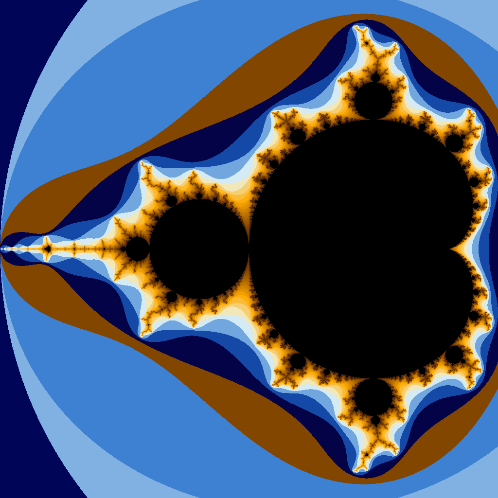

Render the [full Mandelbrot set](#full--default-1) (default, 1024×1024):

```sh
$ poetry run tranz --no-db --no-date image mandel

1024 x 1024 Mandelbrot, 10^0.000 magnitude...
Compute: {[MANDELBROT: (-3/4, 0) ± 5/2] : [1024, 1024, AUTO]}
Pre: 100%|█████████████████████████████████████████████| 256/256 [00:00<00:00, 348844.00px/s]
Picked depth 1000, histogram {2: 20, 3: 64, 4: 40, ...: 68, 35: 2, 57: 2, 222: 2}, 58/256 set points
Img: 100%|█████████████████████████████████████████████| 1048576/1048576 [00:02<00:00, 409838.53px/s]
Compute: Mandelbrot: DONE, with precision 140 bits, 30.150 MiB, in 3.658 s

Render: {[PNG, SAHARA, none]}
Render: PNG: DONE, '0d4139e11c83f741bfc38ad7192d1c2a77decd85bb0fa512bd7ed6d291af0e02' in 1.212 s, 447.901 KiB
Saved to 'mandel-0d4139e11c83f741bfc3.png', 447.901 KiB
```

As can be seen, the `Frame` is stored as rational numbers with arbitrary precision, `[(-3/4, 0) ± 5/2]`, so it is guaranteed to be exact (centered in $-0.75+0j$ and with width of $2.5$). It will pick a precision, in bits, which is the internal `float` representation (mantissa), and will pick the (max) number of iterations for the generation. The magnitude shown is `10^0.00` because it is the full Mandelbrot set (magnification 1). There will be a progress bar, counting the horizontal lines being produced. The generated image data will be hashed and then saved to a PNG on disk.

Render a [well-known zoom ("Seahorse", ~155× magnification)](#seahorse-155) at the default 1024×1024:


```sh
poetry run tranz image mandel " -0.74303" "0.126433" "0.01611"
```

You can also extract details from the set points (the traditionally black part of the image) using `--set` and `--set-palette`. For example:

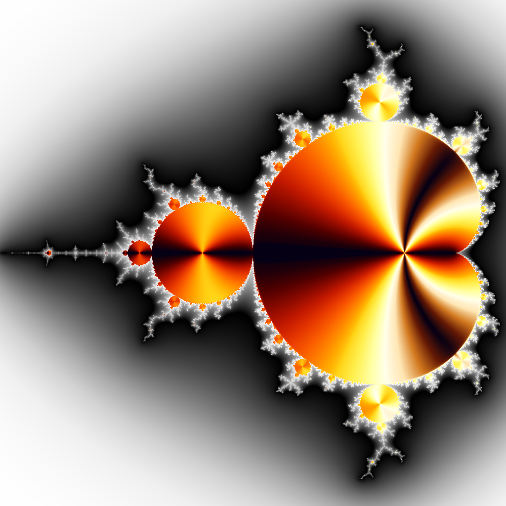

```sh
poetry run tranz --set imaginary --set-palette "lava" --palette "rgrayscale" image mandel
```

See many more examples in *[Comprehensive example images and zooms](#comprehensive-example-images-and-zooms)*.

### Palettes

With the `--palette` global flag you can pick your color scheme for exterior (escaped) pixels. With `--set-palette` you can pick the color scheme for interior Set points (only visible when `--set` is also given). We provide the following palettes:

| | | |
| :---: | :---: | :---: |
| 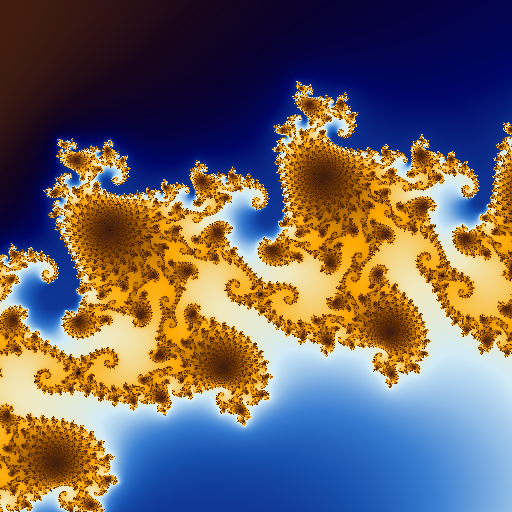 |  |  |
| **`"sahara"` (DEFAULT)** | **`"lava"`** | **`"electric"`** |
|  | 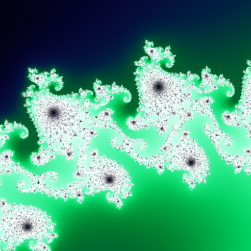 | 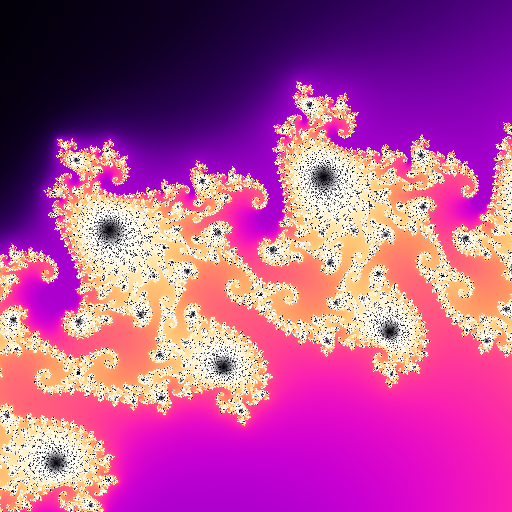 |
| **`"sunset"`** | **`"aurora"`** | **`"plasma"`** |
| 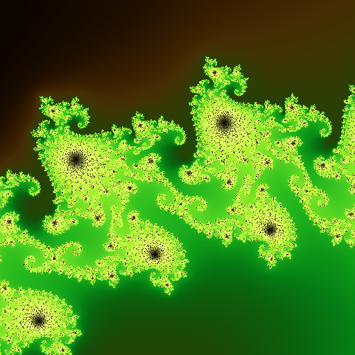 | 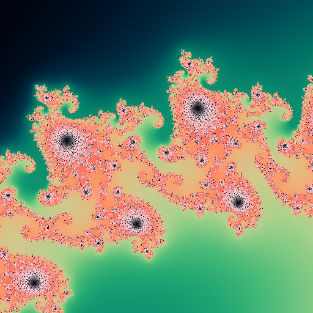 | 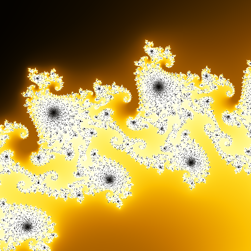 |
| **`"forest"`** | **`"coral"`** | **`"gold"`** |
| 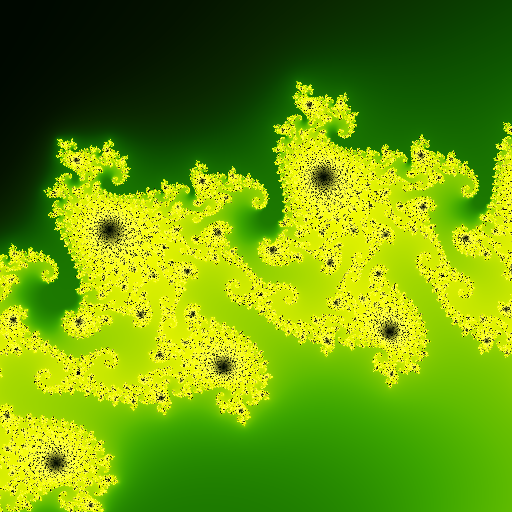 | 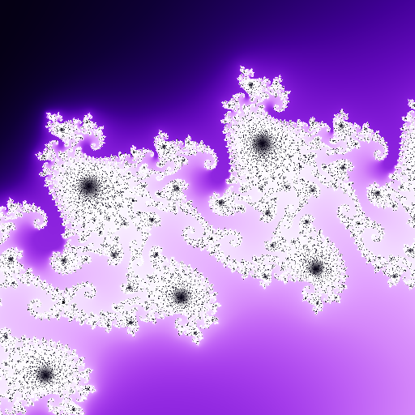 | 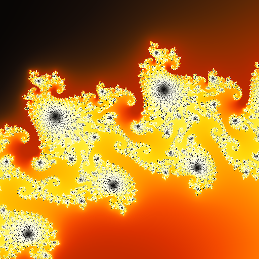 |
| **`"toxic"`** | **`"iris"`** | **`"ember"`** |
| 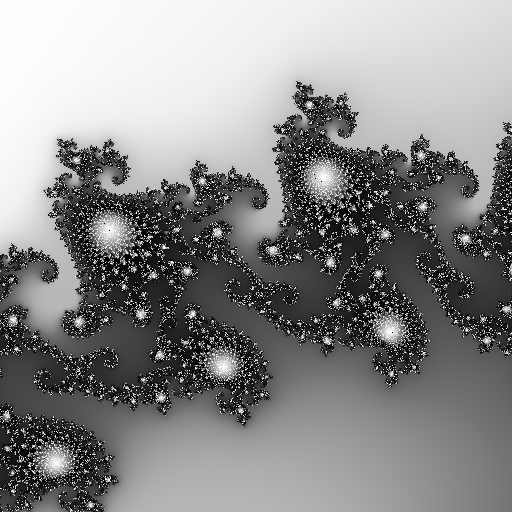 | 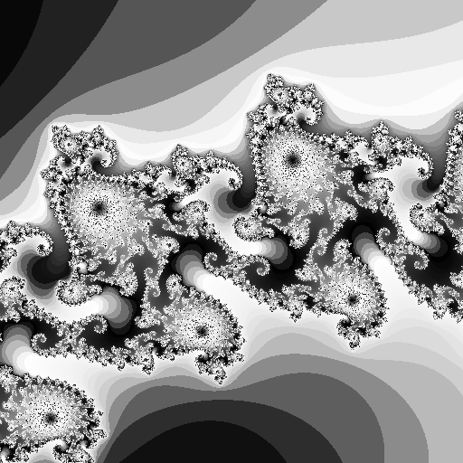 | |
| **`"rgrayscale"` (DEFAULT for `--set-palette`)** | **`"grayscale"`** | |

### Command structure

```sh
tranz [global flags] <subgroup> <command> [args]
```

Available subgroup / command combinations:

- `tranz image mandel` — render a Mandelbrot image
- `tranz image julia` — render a Julia Set image
- `tranz image read` — read and inspect a tranZoom image
- `tranz image clean` — create a clean, metadata-free copy of a tranZoom image for sharing
- `tranz zoom ai` — AI-guided iterative zoom session
- `tranz zoom manual` — human-guided iterative zoom session
- `tranz zoom auto` — automated GIF/MP4 zoom animation
- `tranz markdown` — generate CLI documentation

### `tranz` global flags

| Flag | Description | Default |
| --- | --- | --- |
| `--help` | Show help | off |
| `--version` | Show version and exit | off |
| `-v`, `-vv`, `-vvv`, `--verbose` | Verbosity (nothing=*ERROR*, `-v`=*WARNING*, `-vv`=*INFO*, `-vvv`=*DEBUG*) | *ERROR* |
| `--color`/`--no-color` | Force enable/disable colored output (respects `NO_COLOR` env var if not provided) | `--color` |
| `--threads` | Number of worker processes for rendering (1–N, default: all available cores) | all cores |
| `-o`/`--out` | Output directory path | current directory |
| `--prefix` | Filename prefix | None = `mandel`/`julia` |
| `--date`/`--no-date` | Include date-time (`YYYYMMDDhhmmss`) in filename | `--date` |
| `--hash`/`--no-hash` | Include 20-char SHA256 hash in filename | `--hash` |
| `--force`/`--no-force` | Force re-computation and re-rendering even when matching DB cache entries exist | `--no-force` |
| `--iterm`/`--no-iterm` | Print image inline in iTerm2 (macOS + iTerm2 only) | off |
| `--db`/`--no-db` | Enable/disable the fractal DB for this invocation; overrides the `use_db` config setting | config value / False |
| `--readonly-db`/`--no-readonly-db` | Open the DB in read-only mode (reads allowed, no writes or saves) | `--no-readonly-db` |
| `--pass` | DB encryption password; omit for no encryption; `--pass ""` prompts securely (hidden input); `--pass "pwd"` passes inline (visible in shell history) | None (no encryption) |
| `--palette` | Color palette for exterior (escaped) pixels; one of `sahara`, `lava`, `electric`, `sunset`, `aurora`, `plasma`, `forest`, `coral`, `gold`, `toxic`, `iris`, `ember`, `rgrayscale`, `grayscale` | `sahara` |
| `--set-palette` | Color palette for interior Set points (used only when `--set` is given) | `rgrayscale` |
| `--set` | Algorithm for interior Set point coloring; one of `min`, `max`, `angle`, `imaginary`; omit to keep interior black | None |
| `-m`/`--model` | LMStudio vision model identifier to load | `qwen3-vl-32b-instruct@q8_0` |
| `--spec-tokens` | Speculative decoding tokens | model default |
| `--seed` | Random seed for the model | random |
| `-c`/`--context` | Context window size in tokens | model default |
| `-x`/`--temperature` | Sampling temperature | `0.15` |
| `--gpu` | GPU usage ratio (`0.0`–`1.0`) | `0.80` |
| `--gpu-layers` | Number of model layers to offload to GPU | `-1` (as many as possible) |
| `--fp16` | Use FP16 precision | off |
| `--mmap`/`--no-mmap` | Use memory-mapped model files | on |
| `--flash`/`--no-flash` | Use flash attention | on |
| `--kv-cache` | Key-value cache size | model default |
| `--timeout` | Model operation timeout in seconds | `300.0` |

### `tranz image` subgroup flags

These flags apply to all `tranz image` commands and must be placed **between `image` and the sub-command name**:

```sh
tranz [global flags] image [-w W] [-h H] [-s S] [--iter N] [--mark COORD] <mandel|julia|read> [args]
```

| Flag | Description | Default |
| --- | --- | --- |
| `-w`/`--width` | Output image width in pixels (16–16384) | 1024 |
| `-h`/`--height` | Output image height in pixels (16–16384) | 1024 |
| `-s`/`--size` | Max pixel side; **overrides** `-w`/`-h` and scales the other dimension proportionally to match the frame aspect ratio | None (use `-w`/`-h`) |
| `-i`/`--iter` | Override max iterations (depth); `1000`–4294967295 | automatic adaptive search |
| `--mark` | Draw a crosshair at this complex coordinate, formatted as `"(re, im)"` | None |
| `--mark-color` | Color of the crosshair; one of `black`, `white`, `red`, `green`, `blue`, `yellow`, `cyan`, `magenta` | `red` |
| `--mark-width` | Line width of the crosshair (1–50) | `1` |

### `tranz zoom` subgroup flags

These flags apply to all `tranz zoom` commands and must be placed **between `zoom` and the sub-command name**:

```sh
tranz [global flags] zoom [-w W] [-h H] [-s S] [-f FRACTAL] [-n STEPS] [--julia-re RE] [--julia-im IM] [--mark COORD] <ai|manual|auto> [args]
```

| Flag | Description | Default |
| --- | --- | --- |
| `-w`/`--width` | Output image width in pixels (16–16384) | 512 |
| `-h`/`--height` | Output image height in pixels (16–16384) | 512 |
| `-s`/`--size` | Max pixel side; **overrides** `-w`/`-h` and scales proportionally | None (use `-w`/`-h`) |
| `-f`/`--fractal` | Fractal type: `mandelbrot` or `julia` | `mandelbrot` |
| `--julia-re` | Real part of the Julia Set constant `c` | `'0.27334'` |
| `--julia-im` | Imaginary part of the Julia Set constant `c` | `'0.00742'` |
| `-n`/`--max-steps` | Max zoom steps; `0` = unlimited (Ctrl+C to stop) | `0` |
| `--mark` | Draw a crosshair at this complex coordinate on every frame, formatted as `"(re, im)"` | None |
| `--mark-color` | Color of the crosshair; one of `black`, `white`, `red`, `green`, `blue`, `yellow`, `cyan`, `magenta` | `red` |
| `--mark-width` | Line width of the crosshair (1–50) | `1` |

Palette flags (`--palette`, `--set-palette`, `--set`) are **global flags** (placed before the subgroup name) and apply to all zoom commands as well as image commands.

### CLI Commands Documentation

Auto-generated CLI reference:

- [**`tranz` documentation**](tranz.md)

### `tranz image mandel` — Render a Mandelbrot image

```sh
poetry run tranz [global flags] image [-w WIDTH] [-h HEIGHT] [--iter N] mandel [CENTER_RE] [CENTER_IM] [F_WIDTH] [F_HEIGHT]
```

Positional arguments (all optional; defaults show the full Mandelbrot set):

| Argument | Description | Default |
| --- | --- | --- |
| `CENTER_RE` | Real part of the center point (string, for exact precision); **or** a path to an existing tranZoom PNG — the frame is then read from that image's metadata, and the remaining frame arguments are ignored | `'-0.75'` |
| `CENTER_IM` | Imaginary part of the center point (string, for exact precision) | `'0'` |
| `F_WIDTH` | Width of the frame in the real plane | `'2.5'` |
| `F_HEIGHT` | Height of the frame in the imaginary plane | same as `F_WIDTH` |

Image size and render options are set at the `tranz image` subgroup level (see [above](#tranz-image-subgroup-flags)).

**Tip — re-render from a saved image:** pass a tranZoom PNG path as `CENTER_RE` to pick up exactly the same frame:

```sh
poetry run tranz image mandel "/path/to/saved.png"
```

The command:

1. Constructs a `Frame` from the given coordinates using `gmpy2.mpq` exact arithmetic
2. Calculates the required `mpfr` precision automatically based on zoom depth
3. When `--iter` is not given, runs an adaptive pre-pass on a tiny 16×16 render to estimate the optimal `max_iter` for the frame (with a 1.5× safety margin); otherwise uses the value supplied
4. Renders all pixels in parallel using `ProcessPoolExecutor` (one process per available CPU core, up to 12), each writing an interleaved subset of rows; results are merged into the final image
5. Each process uses the escape-time algorithm with cardioid/period-2 bulb interior shortcuts and histogram-equalized color palette
6. Saves the PNG to `<prefix>[-<YYYYMMDDhhmmss>][-<SHA256-20>].png` in the working directory (or the path given by `-o/--out`)

See below for many example outputs.

### `tranz image julia` — Render a Julia Set image

```sh
poetry run tranz [global flags] image [-w WIDTH] [-h HEIGHT] [-s SIZE] [--iter N] [--mark COORD] julia [POINT_RE] [POINT_IM] [CENTER_RE] [CENTER_IM] [F_WIDTH] [F_HEIGHT]
```

Positional arguments (all optional; defaults show the "Julia Suzana" set):

| Argument | Description | Default |
| --- | --- | --- |
| `POINT_RE` | Real part of the Julia constant `c`; **or** a path to an existing tranZoom PNG — the Julia constant is then read from that image's `tranzoom:frame:julia_re` metadata | `'0.27334'` |
| `POINT_IM` | Imaginary part of the Julia constant `c` | `'0.00742'` |
| `CENTER_RE` | Real part of the frame center | `'0'` |
| `CENTER_IM` | Imaginary part of the frame center | `'0'` |
| `F_WIDTH` | Width of the frame in the real plane | `'1.8'` |
| `F_HEIGHT` | Height of the frame in the imaginary plane | `'2.2'` |

Image size and render options are set at the `tranz image` subgroup level (see [above](#tranz-image-subgroup-flags)).

**Tip — proportional sizing:** use `-s` instead of `-w`/`-h` so the output image always matches the frame's aspect ratio:

```sh
poetry run tranz --palette electric image -s 1024 julia
```

**Tip — re-render from a saved image:** pass a tranZoom PNG path as `POINT_RE` to pick up the same Julia constant:

```sh
poetry run tranz image julia "/path/to/saved.png"
```

### `tranz image read` — Read a tranZoom image

```sh
poetry run tranz [--iterm] image read <IMAGE_PATH>
```

Reads an existing tranZoom image (PNG, GIF, or MP4) and pretty-prints all embedded metadata:

```sh
$ poetry run tranz image read mandel-38824cdaa58b64496ebf.png

'/path/to/mandel-38824cdaa58b64496ebf.png'
1024x1024 (wxh) / 38824cdaa58b64496ebfd86facf4d4ba4596ab18db95ac97afd643a7a892ff83

{
  "tranzoom:frame:fractal": "mandelbrot",
  "tranzoom:frame:top_re": "-7436499/10000000",
  ...
}
```

Use `--iterm` (global flag) to also display the image inline (macOS + iTerm2 only).

### `tranz image clean` — Create a clean copy for sharing

```sh
poetry run tranz image clean [--hash|--no-hash] [--path|--no-path] [--out FORMAT] <IMAGE_PATH>
```

Reads an existing tranZoom PNG and saves a **clean copy** with all tranZoom metadata stripped out: safe to share without leaking fractal coordinates or computation details.

Options:

| Option | Description | Default |
| --- | --- | --- |
| `--hash`/`--no-hash` | Keep safe hashes (frame/computation/render/image hashes) in the output metadata | `--hash` (keep) |
| `--path`/`--no-path` | Replace the filename with a random `fractal-<HEX20>.ext` to avoid leaking filenames | `--no-path` (keep name) |
| `--out FORMAT` | Output format: `jpeg`/`jpg` (default) or `png` | `jpeg` |

**Note:** For PNG output, hashes are stored as PNG tEXt chunks. For JPEG output, hashes are serialized as compact JSON and stored in the EXIF `ImageDescription` field (tag 0x010E). GIF and MP4 inputs are not currently supported. Examples:

```sh
# Clean a PNG to JPEG, keep filename shape, retain safe hashes (default behavior)
poetry run tranz image clean /path/to/image.png
# → /path/to/image.clean.jpg

# Fully anonymous: generic random filename, no metadata at all
poetry run tranz image clean --no-hash --path /path/to/image.png
# → /path/to/fractal-a3f7b2c1d4e5f6019a2b.jpg

# Keep as PNG so hash metadata is actually embedded
poetry run tranz image clean --out png /path/to/image.png
# → /path/to/image.clean.png  (with frame/computation hashes in PNG text chunks)
```

### `tranz zoom ai` — AI-guided fractal zoom search

```sh
poetry run tranz [global flags] zoom [-w WIDTH] [-h HEIGHT] [-n STEPS] ai \
  [CENTER_RE] [CENTER_IM] [F_WIDTH] [F_HEIGHT] [-q QUERY] [--reason] [--memory N]
```

Starts an AI-guided iterative zoom session:

1. Renders the current frame (default: 512×512, configurable via `tranz zoom -w/-h`)
2. Draws a 3×3 thirds grid with green sector numbers on top
3. Sends the image to the LLM vision model with a fractal-scoring prompt
4. Parses the structured response (9 sector scores)
5. Navigates the frame toward the highest-scoring sector (by ~1/3 of the frame size)
6. Saves the image with full LLM evaluation embedded in PNG metadata
7. Repeats until Ctrl+C or `--max-steps` is reached

Supports both Mandelbrot (default) and Julia Set fractals: use `-f julia` (and optionally `--julia-re`/`--julia-im`) on the `tranz zoom` subgroup callback.

Positional frame arguments:

| Argument | Description | Default |
| --- | --- | --- |
| `CENTER_RE` | Real part of the starting frame center; **or** a path to an existing tranZoom PNG (frame is read from image metadata; other frame arguments ignored) | `'-0.75'` (full set) |
| `CENTER_IM` | Imaginary part of the starting frame center | `'0'` |
| `F_WIDTH` | Starting frame width | `'2.5'` |
| `F_HEIGHT` | Starting frame height | same as `F_WIDTH` |

Command-level options (on `tranz zoom ai` only):

| Option | Description | Default |
| --- | --- | --- |
| `-q`/`--query` | Targeted search query added to the scoring prompt | None |
| `--reason/--no-reason` | Include LLM reasoning text per sector | off |
| `--memory` | Number of previous steps in LLM chat history | `5` |

Image size and step count are set at the `tranz zoom` subgroup level (see [above](#tranz-zoom-subgroup-flags)); `--iterm` is a global flag.

Example — start from the full set, zoom using default model at default 512×512:

```sh
poetry run tranz zoom ai
```

Example — start from the Seahorse Tail, targeted search, 10 steps, show images, custom model:

```sh
poetry run tranz --iterm -m "qwen3-vl-32b-instruct@q8_0" -x 0.7 zoom -n 10 ai \
  " -0.7436499" "0.13188204" "0.00073801" \
  -q "spiral"
```

Example — resume a previous session from a saved tranZoom PNG (frame read from image metadata):

```sh
poetry run tranz zoom ai "/path/to/saved.png"
```

### `tranz zoom manual` — Manually-guided fractal zoom

```sh
poetry run tranz [--iterm] zoom [-w WIDTH] [-h HEIGHT] [-n STEPS] manual \
  [CENTER_RE] [CENTER_IM] [F_WIDTH] [F_HEIGHT]
```

Same iterative rendering loop as `tranz zoom ai`, but at each step the user types a direction (1–9, numpad layout: 5=center/zoom-in, 8=N, 2=S, 4=W, 6=E, 7=NW, 9=NE, 1=SW, 3=SE) instead of querying an LLM. The evaluation is stored in PNG metadata labeled as `HUMAN`.

Positional frame arguments work the same way as `tranz zoom ai`: pass a tranZoom PNG path as `CENTER_RE` to start the session from the frame stored in that image's metadata.

Supports both Mandelbrot (default) and Julia Set fractals via `-f/--fractal` on the `tranz zoom` subgroup callback.

Note: `tranz zoom manual` does **not** require the AI model flags; it does not load an LLM.

### `tranz zoom auto` — Automated GIF/MP4 zoom animation

```sh
poetry run tranz [global flags] zoom [-w WIDTH] [-h HEIGHT] [-s SIZE] [-f FRACTAL] auto \
  [CENTER_RE] [CENTER_IM] [F_WIDTH] [F_HEIGHT] [DEST_MAGNIFICATION_10] \
  [--anim TYPE] [--duration D] [--frames N] [--fps FPS] [--loop L] [--save-frames]
```

Renders a straight zoom-in animation from a starting frame to a target magnification and saves it as an animated GIF or MP4 file. Specify any two of `--duration`, `--frames`, and `--fps` to constrain the third; the command validates that all three resulting values are within allowed bounds.

The zoom progression is geometrically uniform: each successive frame is scaled by a fixed rational factor computed so that the product of all per-frame zoom steps equals exactly the requested total magnification. Zoom metadata such as initial frame size, zoom step, FPS, duration, frame count, and loop count is stored with the final animated output under `tranZoom:zoom:*` PNG text chunks; if you save intermediate PNG frames, they are written as regular tranZoom still images.

A set of **marker frames** is automatically selected from the full frame sequence at regular ≈8.5× magnification intervals (one marker per `MAGNITUDE_PER_FRAME_MARKER = 13/14` decades of zoom). Marker frames serve two purposes: (1) they act as chapter/seek points stored in the DB alongside all frames, and (2) they anchor the `ZoomColorNorm` so that every frame in the animation maps the same escape-iteration value to the same palette position, eliminating per-frame color flickering. All frames are rendered in a single pass; markers are identified in the log in magenta.

Positional arguments:

| Argument | Description | Default |
| --- | --- |
| `CENTER_RE` | Real part of the starting frame center; **or** a path to an existing tranZoom PNG (frame read from image metadata) | `'-0.75'` (full set) |
| `CENTER_IM` | Imaginary part of the starting frame center | `'0'` |
| `F_WIDTH` | Starting frame width | `'2.5'` |
| `F_HEIGHT` | Starting frame height | same as `F_WIDTH` |
| `DEST_MAGNIFICATION_10` | Zoom exponent: total zoom is `10^N`; e.g., `2.0` = 100× zoom | `1.0` |

Command-level options:

| Option | Description | Default |
| --- | --- | --- |
| `--anim` | Output format: `gif` or `mp4` | `gif` |
| `--duration` | Total animation duration in seconds (0.1–45000) | None (computed) |
| `--frames` | Number of frames (3–100000) | None (computed) |
| `--fps` | Frames per second (0.1–30) | None (computed) |
| `--loop` | Number of GIF loops; `0` = infinite (ignored for MP4) | `0` |
| `--save-frames/--no-save-frames` | Save each intermediate PNG frame to disk | off |
| `--max-iter` | Override max iterations (depth) | automatic adaptive search |

Mark options (`--mark`, `--mark-color`, `--mark-width`) are **`tranz zoom` subgroup flags** (see [above](#tranz-zoom-subgroup-flags)) and apply to all zoom commands, including `auto`.

Image size and fractal type are set at the `tranz zoom` subgroup level (see [above](#tranz-zoom-subgroup-flags)); palette flags are global flags.

Example — animate a 10× zoom into the Seahorse Tail, 4 s at 10 FPS, 220×220 pixels:

```sh
poetry run tranz --no-date zoom -s 220 auto \
  " -5578776469/7500000000" "8244620127/62500000000" "0.00073801" "0.00073801" "1" \
  --fps 10 --duration 4
```

To produce an MP4 instead of a GIF, add `--anim mp4`.

### Comprehensive example images and zooms

You can run all these at once by executing `scripts/make_examples.sh`.

#### Full / Default (×1)


Render the full [Mandelbrot set](https://en.wikipedia.org/wiki/Mandelbrot_set) with all the default values (image size 1024×1024, centered in $-0.75+0j$ and with width of $2.5$, a good frame that contains the whole set):

```sh
$ poetry run tranz --no-db --no-date image mandel

1024 x 1024 Mandelbrot, 10^0.000 magnitude...
Compute: {[MANDELBROT: (-3/4, 0) ± 5/2] : [1024, 1024, AUTO]}
Pre: 100%|█████████████████████████████████████████████| 256/256 [00:00<00:00, 348844.00px/s]
Picked depth 1000, histogram {2: 20, 3: 64, 4: 40, ...: 68, 35: 2, 57: 2, 222: 2}, 58/256 set points
Img: 100%|█████████████████████████████████████████████| 1048576/1048576 [00:02<00:00, 409838.53px/s]
Compute: Mandelbrot: DONE, with precision 140 bits, 30.150 MiB, in 3.658 s

Render: {[PNG, SAHARA, none]}
Render: PNG: DONE, '0d4139e11c83f741bfc38ad7192d1c2a77decd85bb0fa512bd7ed6d291af0e02' in 1.212 s, 447.901 KiB
Saved to 'mandel-0d4139e11c83f741bfc3.png', 447.901 KiB
```

This is what tranZoom considers ***`10^0.00 magnitude`*** (magnification 1), and will measure other magnifications against this size.

##### Set Interior Coloring


You can also extract details from the set points (the traditionally black part of the image) using `--set` and `--set-palette`. For example:

```sh
$ poetry run tranz --no-db --set imaginary --set-palette "lava" --palette "rgrayscale" --no-date image mandel

1024 x 1024 Mandelbrot w/ SET 'imaginary', 10^0.000 magnitude...
Compute: {[MANDELBROT: (-3/4, 0) ± 5/2] : [1024, 1024, AUTO] : imaginary}
Pre: 100%|█████████████████████████████████████████████| 256/256 [00:00<00:00, 277.24px/s]
Picked depth 1000, histogram {2: 20, 3: 64, 4: 40, ...: 68, 35: 2, 57: 2, 222: 2}, 58/256 set points
Img: 100%|█████████████████████████████████████████████| 1048576/1048576 [00:20<00:00, 52261.66px/s]
Compute: Mandelbrot: DONE, with precision 140 bits, 60.674 MiB, in 22.475 s

Render: {[PNG, GRAYSCALE_REVERSE, LAVA]}
Render: PNG: DONE, 'bcee34eba7a442b179aa5eb5e3015b14f523d79173ff2f08f70cd532a21f2e9b' in 1.455 s, 445.114 KiB
Saved to 'mandel-bcee34eba7a442b179aa.png', 445.114 KiB
```

Notice how it takes much more time. The interior coloring requires much computation and the whole set (like this image is an example of) has a lot of interior to do, so the whole thing takes almost ten times as long to finish.

#### Seahorse (×155)


Render a [well-known zoom ("Seahorse")](https://en.wikipedia.org/wiki/File:Mandel_zoom_03_seehorse.jpg) to a 1024×1024 image (default size):

```sh
$ poetry run tranz --no-db --no-date image mandel " -0.74303" "0.126433" "0.01611"

1024 x 1024 Mandelbrot, 10^2.191 magnitude...
Compute: {[MANDELBROT: (-74303/100000, 126433/1000000) ± 1611/100000] : [1024, 1024, AUTO]}
Pre: 100%|█████████████████████████████████████████████| 256/256 [00:00<00:00, 2089.49px/s]
Picked depth 9277, histogram {24: 2, 25: 12, 26: 11, ...: 162, 2264: 1, 3215: 1, 6185: 1}, 66/256 set points
Img: 100%|█████████████████████████████████████████████| 1048576/1048576 [00:45<00:00, 22934.20px/s]
Compute: Mandelbrot: DONE, with precision 140 bits, 82.972 MiB, in 47.453 s

Render: {[PNG, SAHARA, none]}
Render: PNG: DONE, 'a08eaf11d2fdcd542bf4e1f22ba8f981b42a6f62f96d443d4e1bb027c9653033' in 1.600 s, 1.023 MiB
Saved to 'mandel-a08eaf11d2fdcd542bf4.png', 1.023 MiB
```

This one also is time consuming, and definitely demands more time than even much deeper zooms. It has the features that make an image demand computation: a lot of set points (half the image is black, i.e., set points) and a much larger iteration depth (than the previous examples).

#### Seahorse Tail (×3k)


Render a ["Seahorse Tail"](https://en.wikipedia.org/wiki/File:Mandel_zoom_05_tail_part.jpg) at default 1024×1024:

```sh
$ poetry run tranz --no-db --set imaginary --no-date image mandel " -0.7436499" "0.13188204" "0.00073801"

1024 x 1024 Mandelbrot w/ SET 'imaginary', 10^3.530 magnitude...
Compute: {[MANDELBROT: (-7436499/10000000, 3297051/25000000) ± 73801/100000000] : [1024, 1024, AUTO] : imaginary}
Pre: 100%|█████████████████████████████████████████████| 256/256 [00:00<00:00, 55378.92px/s]
Picked depth 1000, histogram {37: 8, 38: 11, 39: 14, ...: 220, 415: 1, 465: 1, 650: 1}, 0/256 set points
Img: 100%|█████████████████████████████████████████████| 1048576/1048576 [00:10<00:00, 96775.13px/s]
Compute: Mandelbrot: DONE, with precision 140 bits, 75.760 MiB, in 11.986 s

Render: {[PNG, SAHARA, GRAYSCALE_REVERSE]}
Render: PNG: DONE, 'e4fad99036a41cc87ad0997ee49677f54259d37178899086e62f16d5879de1d9' in 1.814 s, 1.019 MiB
Saved to 'mandel-e4fad99036a41cc87ad0.png', 1.019 MiB
```

This image is relatively fast to generate (despite the zoom level, it has very little interior regions), so we use it in the unit and integration tests to make sure we are operating consistently. If the hash of this image changes, remember to change it in `src/tranzoom/cli/base.py`.

#### Seahorse Tail Zoom

| GIF | MP4 |
| --- | --- |
| 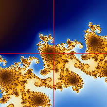 |  |

You can easily make animations!

```sh
$ poetry run tranz --no-db --no-date zoom -s 220 --mark "(-5578776469/7500000000,8244620127/62500000000)" auto " -5578776469/7500000000" "8244620127/62500000000" "0.00073801" "0.00073801" "1" --fps 10 --duration 4

220 x 220 'sahara' 'Mandelbrot' 10^1.0000 magnitude ZOOM, 4.000 s long, at 10.00 FPS, with 40 frames, 106.0818%/step...
ZOOM: <GIF: {[MANDELBROT: (-5578776469/7500000000, 8244620127/62500000000) ± 73801/100000000] : [220, 220, AUTO]} -> {[PNG, SAHARA, none] + [MARK: red/1 @
(-5578776469/7500000000, 8244620127/62500000000)]} / (mag:1, n:40, d:4, fps:10, l:0)> ... [MANDELBROT: (-5578776469/7500000000, 8244620127/62500000000) ±
73801/1000000000]

Marker Frame 1 / 40
220 x 220 Mandelbrot, 10^3.530 magnitude...
Compute: {[MANDELBROT: (-5578776469/7500000000, 8244620127/62500000000) ± 73801/100000000] : [220, 220, AUTO]}
Pre: 100%|█████████████████████████████████████████████| 256/256 [00:00<00:00, 56090.57px/s]
Picked depth 1000, histogram {36: 14, 37: 20, 38: 21, ...: 198, 439: 1, 478: 1, 639: 1}, 0/256 set points
Img: 100%|█████████████████████████████████████████████| 48400/48400 [00:00<00:00, 97230.95px/s]
Compute: Mandelbrot: DONE, with precision 140 bits, 7.025 MiB, in 1.167 s

Frame 2 / 40
[...builds frames 2–40...]

ZOOM: Color norm: built from 2 marker frames

Render: {[PNG, SAHARA, none] + [MARK: red/1 @ (-5578776469/7500000000, 8244620127/62500000000)]}
Render: 100%|█████████████████████████████████████████████| 40/40 [00:04<00:00,  9.05fr/s]
Render: DONE

Success: GIF '0ef4d4d828a2ad99c623f699ae936d5f02b15a557428677a3773f1386e2227fa' in 45.696 s (frames) + 4.749 s (render)
Saved GIF to 'mandel-0ef4d4d828a2ad99c623.gif', 1.757 MiB
```

To make that an MP4, just add `--anim mp4` to the command.

#### Julia Suzana (×1)

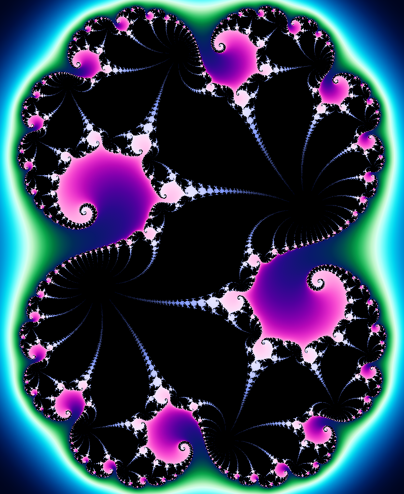

Render a "Julia Suzana" at `-s/--size` 1024, one of the possible [Julia Set](https://en.wikipedia.org/wiki/Julia_set):

```sh
$ poetry run tranz --no-db --no-date --palette electric image -s 1024 julia

838 x 1024 Julia, 10^0.000 magnitude...
Compute: {[JULIA: (0, 0) ± (9/5, 11/5) @ (13667/50000, 371/50000)] : [838, 1024, AUTO]}
Pre: 100%|█████████████████████████████████████████████| 256/256 [00:01<00:00, 149.50px/s]
Picked depth 1000, histogram {2: 12, 3: 16, 4: 34, ...: 64, 41: 2, 44: 2, 45: 2}, 124/256 set points
Img: 100%|█████████████████████████████████████████████| 858112/858112 [00:27<00:00, 30824.30px/s]
Compute: Julia: DONE, with precision 140 bits, 23.736 MiB, in 30.537 s

Render: {[PNG, ELECTRIC, none]}
Render: PNG: DONE, 'b97d669ec0da38ab23929cf73a3fc4a46d79f4e8ab4ef0faca8480fd551685a6' in 730.539 ms, 511.996 KiB
Saved to 'julia-b97d669ec0da38ab2392.png', 511.996 KiB
```

#### Julia Suzana Wave (×427)


Render a "Julia Suzana Wave" at `-s/--size` 1024:

```sh
$ poetry run tranz --no-db --palette electric --set max --set-palette sunset --no-date image -s 512 julia "13667/50000" "371/50000" " -313420497/429687500" "0.6567" "0.00544" "0.004"

512 x 377 Julia w/ SET 'max', 10^2.630 magnitude...
Compute: {[JULIA: (-313420497/429687500, 6567/10000) ± (17/3125, 1/250) @ (13667/50000, 371/50000)] : [512, 377, AUTO] : max}
Pre: 100%|█████████████████████████████████████████████| 256/256 [00:01<00:00, 135.75px/s]
Picked depth 1819, histogram {43: 2, 44: 14, 45: 14, ...: 98, 147: 1, 208: 1, 1213: 1}, 125/256 set points
Img: 100%|█████████████████████████████████████████████| 193024/193024 [00:11<00:00, 17525.49px/s]
Compute: Julia: DONE, with precision 140 bits, 31.230 MiB, in 13.959 s

Render: {[PNG, ELECTRIC, SUNSET]}
Render: PNG: DONE, '8f06e7bcd0ea14dff1b6fc3c829cdc295367695fea882e2cf9e25bb1a6dfb5fc' in 300.182 ms, 160.661 KiB
Saved to 'julia-8f06e7bcd0ea14dff1b6.png', 160.661 KiB
```

If the hash of this image changes, remember to change it in `src/tranzoom/cli/base.py`.

#### Powers of 1000

Centering on exactly:

$-0.7436438870371587047521915061147740000000008 + 0.13182590420531197049313205638514950000008j$

or, if you want to use as parameters:

`"(-0.7436438870371587047521915061147740000000008, 0.13182590420531197049313205638514950000008)"`

We have, for fun, generated a sequence of powers of 1000, demonstrating the amazing power of the infinite. The view size of each image is always $2.5$ times some power of 1000.

| Image | Bits | Size $2.5\times$ | Equivalent real-world size / Landmark examples |
| :---: | :---: | :---: | :--- |
| 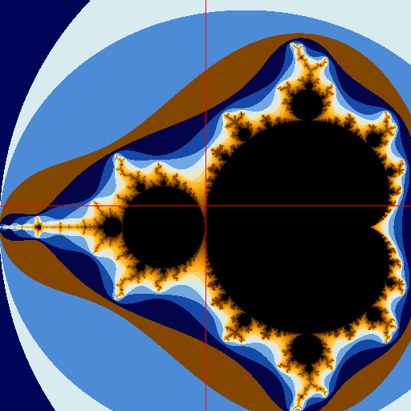 | $140$ | $1$ | $\sim 10^{11}$ light-years = Observable-universe scale, about $93$ billion light-years across. |
|  | $140$ | $10^{-3}$ | $\sim 10^{8}$ light-years = Cosmic-web / supercluster scale: galaxy walls, voids. |
| 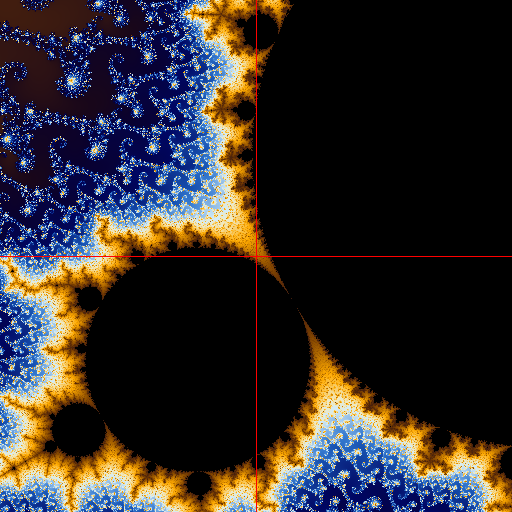 | $140$ | $10^{-6}$ | $\sim 10^{5}$ light-years = Galaxy scale: the Milky Way is about $100{,}000$ light-years across. |
| 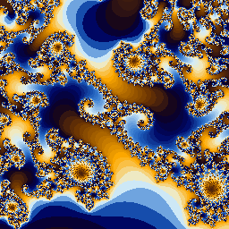 | $146$ | $10^{-9}$ | $\sim 100$ light-years = Local stellar-neighborhood scale: nearby star groups, nebulae, and star-forming regions. |
| 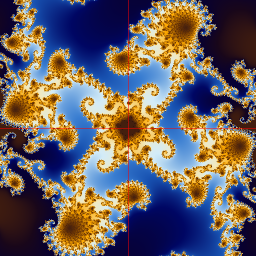 | $156$ | $10^{-12}$ | $\sim 0.1$ light-year = Outer-solar-system scale: comparable to the distant Oort-cloud region. |
| 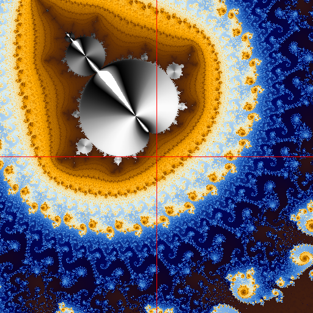 | $166$ | $10^{-15}$ | $\sim 10^{9}\,\mathrm{km}$ = Inner-to-middle solar-system scale: comparable to giant-planet orbital distances. |
| 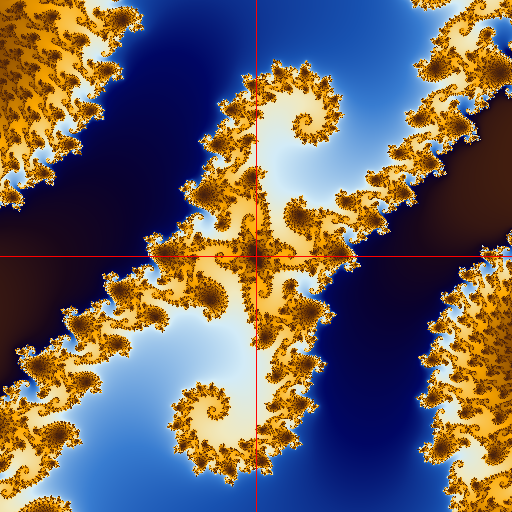 | $176$ | $10^{-18}$ | $\sim 10^{6}\,\mathrm{km}$ = Star / giant-planet scale: the Sun’s diameter is about $1.39 \times 10^{6}\,\mathrm{km}$. |
|  | $186$ | $10^{-21}$ | $\sim 10^{3}\,\mathrm{km}$ = Planetary-geography scale: large countries, small moons, continent-scale weather systems. |
| 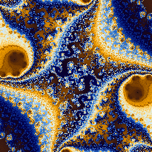 | $196$ | $10^{-24}$ | $\sim 1\,\mathrm{km}$ = Human landscape scale: mountains, city districts, bridges, runways. |
| 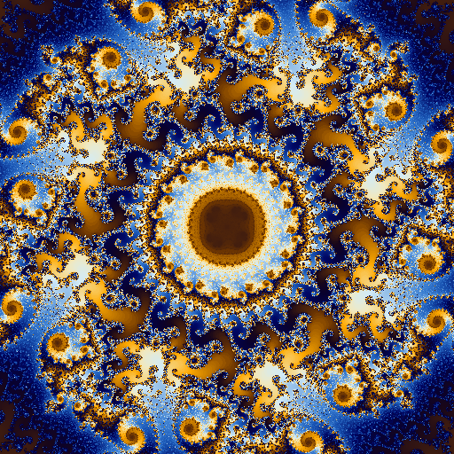 | $206$ | $10^{-27}$ | $\sim 1\,\mathrm{m}$ = Human/body scale: a person, table, doorway, musical instrument. |
|  | $216$ | $10^{-30}$ | $\sim 1\,\mathrm{mm}$ = Small visible-object scale: sand grains, seeds, insect parts, raindrops. |
| 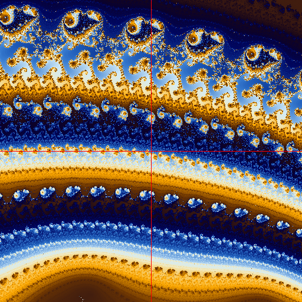 | $226$ | $10^{-33}$ | $\sim 1\,\mu\mathrm{m}$ = Cell/microbe scale: bacteria, organelles, and wavelengths near visible/infrared light. |
| 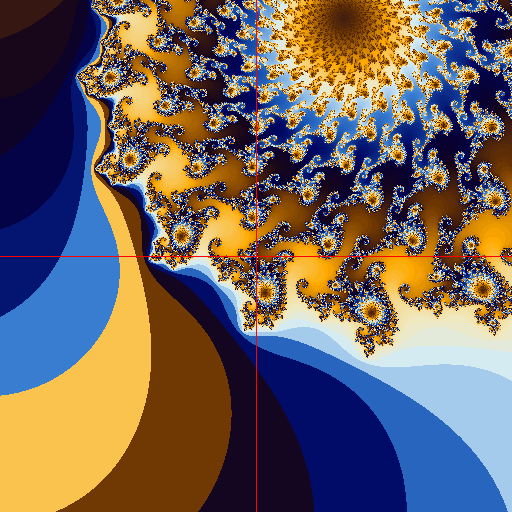 | $236$ | $10^{-36}$ | $\sim 1\,\mathrm{nm}$ = Molecule scale: DNA width, proteins, small molecular machines. |
| 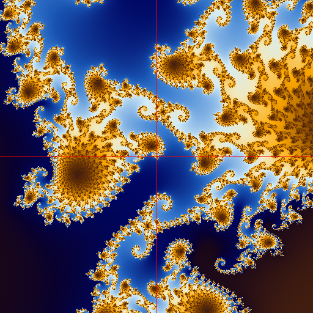 | $246$ | $10^{-39}$ | $\sim 1\,\mathrm{pm}$ = Deep atomic/electron-cloud scale: smaller than typical atomic diameters, which are around $10^{-10}\,\mathrm{m}$. |
|  | $256$ | $10^{-42}$ | $\sim 1\,\mathrm{fm}$ = Atomic nucleus / proton scale: the proton rms charge radius is about $8.4075 \times 10^{-16}\,\mathrm{m}$. |
| 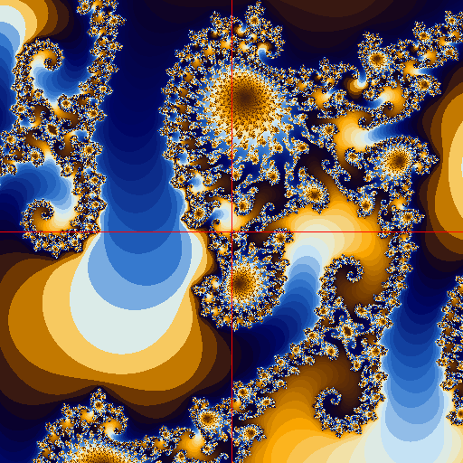 | $266$ | $10^{-45}$ | $\sim 1\,\mathrm{am}$ = Quarks and leptons: elementary particles in the Standard Model |

### Configuration

Config files are stored in OS-native locations via `transcrypto.utils.config`:

- macOS: `~/Library/Application Support/tranzoom/config.bin`
- Linux: `~/.config/tranzoom/config.bin`
- Windows: `%APPDATA%\tranzoom\config.bin`

### Color and formatting

The CLI respects the `NO_COLOR` environment variable and the `--no-color` / `--color` flag. Rich markup is used for console output — see [Rich markup conventions](https://rich.readthedocs.io/en/latest/markup.html).

### Exit codes

| Code | Meaning |
| --- | --- |
| 0 | Success |
| 1 | Generic failure |
| 2 | CLI usage error (bad arguments) |

## Project Design

### Modules / packages

| Component | Responsibility |
| --- | --- |
| `tranz.py` | `tranz` CLI entry point — global options, `tranz markdown` |
| `cli/base.py` | Shared CLI options, defaults, `DEFAULT_MANDELBROT_FRAME`, `ProduceFractalImage()` |
| `cli/imagecommand.py` | `tranz image mandel`, `tranz image julia`, `tranz image read`, and `tranz image clean` command implementations |
| `cli/zoomcommand.py` | `tranz zoom ai`, `tranz zoom manual`, and `tranz zoom auto` command implementations |
| `core/fractal.py` | `Mandelbrot()` and `Julia()` renderers — fractal math; uses `AVAILABLE_CPU` / `MAX_CONCURRENCE` from `frame.py` |
| `core/frame.py` | `SerializingFractalObject` base class; `Frame` class, `ComputationParameters` class (with size-estimation properties), `Fractal` enum, base coordinate math; `DeepSize()` for recursive object-size estimation; `AVAILABLE_CPU`, `MAX_PRE_PROCESS_CONCURRENCE`, `MAX_CONCURRENCE`; size threshold constants |
| `core/image.py` | `Image` class (with inner `ZoomColorNorm` / `FrameColorNorm` for stable cross-frame color normalization); `RenderParameters`, `ZoomParameters`, `ImageOutputConfig`; image utilities, overlays, iTerm2 printing, metadata helpers; `ReWriteAnimatedGIFMeta()` / `ReWriteVideoMP4Meta()` for metadata-only rewrites; `CleanSavePNG()` / `CleanSaveJPG()` for metadata-stripped output |
| `core/palette.py` | Palette definitions and color mapping |
| `core/queries.py` | AI prompt templates and Pydantic models for structured LLM responses |
| `core/ai.py` | `ZoomLoop()` — iterative AI and manual zoom session logic |
| `core/frdb.py` | `FractalDatabase` — persistent storage for frames, computations, renders, and video entries; `DoComputation()` / `DoRender()` are the split rendering primitives, each returning a `bool` indicating whether work was freshly done or loaded from cache; `is_read_write` property; `FindComputation()` / `FindRender()` for cache lookups; `SaveImageData` / `LoadImageData` for raw pixel cache I/O (histograms stripped on save, rebuilt on load) |
| `utils/template.py` | Template for new utility modules |

### Performance characteristics

Rendering is CPU-bound. Time scales roughly with `width × height × max_iter × precision_overhead`. For deep zooms, higher precision means slower `mpfr` arithmetic (roughly linear in the number of bits). For very deep zooms (>100 bits precision), rendering a 256×256 image at 50k iterations can take minutes to hours. The `tqdm` progress bar shows per-row speed.

The `Mandelbrot()` function pre-computes all X-axis `mpfr` values once per image and reuses them across rows, which is an important optimization since `mpfr` construction is expensive at high precision.

## Development Instructions

### File structure

```txt
.
├── CHANGELOG.md                  ⟸ latest changes/releases
├── LICENSE
├── Makefile
├── tranz.md                      ⟸ auto-generated CLI doc (by `make docs` or `make ci`)
├── poetry.lock                   ⟸ maintained by Poetry; do not manually edit
├── pyproject.toml                ⟸ most important configurations live here
├── README.md                     ⟸ this documentation
├── SECURITY.md                   ⟸ security policy
├── requirements.txt
├── .editorconfig
├── .gitignore
├── .pre-commit-config.yaml       ⟸ pre-submit configs
├── .github/
│   ├── copilot-instructions.md
│   ├── dependabot.yaml
│   └── workflows/
│       ├── ci.yaml
│       └── codeql.yaml
├── .vscode/
│   ├── extensions.json
│   └── settings.json
├── scripts/
│   ├── benchmarks.py             ⟸ quick benchmarks for encoding/decoding
│   ├── make_examples.sh          ⟸ renders example images at all zoom levels to test/data/images
│   └── _template.py              ⟸ template for standalone executable scripts
├── src/
│   └── tranzoom/
│       ├── __init__.py           ⟸ version lives here
|       ├── tranz.py              ⟸ TranZoom `tranz` CLI entry point
│       ├── py.typed
│       ├── cli/
│       │   ├── __init__.py
│       │   ├── base.py           ⟸ shared CLI options, frame defaults, config dataclasses
│       │   ├── imagecommand.py   ⟸ `tranz image mandel`, `tranz image read`, and `tranz image clean` implementations
│       │   └── zoomcommand.py    ⟸ `tranz zoom ai`, `tranz zoom manual`, and `tranz zoom auto` implementations
│       ├── core/
│       │   ├── __init__.py
│       │   ├── ai.py             ⟸ ZoomLoop() and ManualLoop() — zoom session logic
│       │   ├── fractal.py        ⟸ Mandelbrot() renderer
│       │   ├── frame.py          ⟸ Frame class, Fractal enum; base for computation
|       |   ├── frdb.py           ⟸ Fractal DB/persistence objects; DoComputation()/DoRender() rendering primitives
│       │   ├── image.py          ⟸ Image class, overlays, iTerm2, metadata helpers
│       │   ├── palette.py        ⟸ Palette definitions
│       │   └── queries.py        ⟸ AI prompt templates and Pydantic response models
│       └── utils/
│           ├── __init__.py
│           └── template.py       ⟸ template for new utility modules
├── tests/
│   ├── tranz_test.py
│   ├── cli/
│   │   ├── base_test.py          ⟸ CLI base.py tests
│   │   └── *command_test.py      ⟸ each command's tests
│   ├── core/
│   │   └── *_test.py             ⟸ each core module's tests
│   └── data/
│       └── images/               ⟸ images used in tests; demo images; README images
└── tests_integration/
    └── test_installed_cli.py     ⟸ whole app (integration) tests
```

### Development Setup

#### Install Python

On **Linux**:

```sh
sudo apt-get update && sudo apt-get upgrade
sudo apt-get install git python3 python3-dev python3-venv build-essential software-properties-common
sudo add-apt-repository ppa:deadsnakes/ppa && sudo apt-get update
sudo apt-get install python3.12  # or python3.13 or python3.14
```

On **macOS**:

```sh
brew update && brew upgrade && brew cleanup -s
brew install git python@3.12  # or python3.13 or python3.14
```

Note: `gmpy2` requires the GMP, MPFR, and MPC C libraries. On macOS: `brew install gmp mpfr mpc`. On Linux: `sudo apt-get install libgmp-dev libmpfr-dev libmpc-dev`.

#### Install Poetry (recommended: `pipx`)

[Poetry reference.](https://python-poetry.org/docs/cli/)

```sh
python3 -m pip install --user pipx
python3 -m pipx ensurepath
pipx install poetry
poetry --version
```

If you will use [PyPI](https://pypi.org/) to publish:

```sh
poetry config pypi-token.pypi <TOKEN>
```

#### Make sure `.venv` is local

```sh
poetry config virtualenvs.in-project true
```

#### Get the repository

```sh
git clone https://github.com/balparda/tranzoom.git
cd tranzoom
```

#### Create environment and install dependencies

```sh
poetry env use python3.12    # creates the .venv with the correct Python version
poetry sync                  # install all dependencies from poetry.lock
poetry env info              # verify environment
poetry run tranz --help      # smoke test
make ci                      # should pass on clean repo
```

To activate the environment:

```sh
source .venv/bin/activate
# ... work ...
deactivate
```

#### Optional: VSCode setup

This repo ships a `.vscode/settings.json` configured to use `./.venv/bin/python`, run `pytest`, format with Ruff, and use Google-style docstrings. Recommended extensions:

- Python (`ms-python.python`)
- Python Environments (`ms-python.vscode-python-envs`)
- Python Debugger (`ms-python.debugpy`)
- Pylance (`ms-python.vscode-pylance`)
- Mypy Type Checker (`ms-python.mypy-type-checker`)
- Ruff (`charliermarsh.ruff`)
- autoDocstring (`njpwerner.autodocstring`)
- Code Spell Checker (`streetsidesoftware.code-spell-checker`)
- markdownlint (`davidanson.vscode-markdownlint`)
- Markdown All in One (`yzhang.markdown-all-in-one`)
- GitHub Copilot (`github.copilot`)

### Build

```sh
poetry build   # builds wheel + sdist in dist/
```

### Run locally

```sh
poetry run tranz --help
poetry run tranz image mandel    # full set, 1024×1024
```

### Testing

#### Unit tests / Coverage

```sh
make test               # plain test run (no integration tests)
make integration        # run the integration tests
poetry run pytest -vvv  # verbose

make cov  # coverage: poetry run pytest --cov=src --cov-report=term-missing
```

Test tags defined in `pyproject.toml`:

| Tag | Meaning |
| --- | --- |
| `slow` | test takes > 1s |
| `flaky` | known flaky test — avoid |
| `stochastic` | may fail with very low probability |

Filter by tag:

```sh
poetry run pytest -vvv -m slow
```

Find slow tests:

```sh
poetry run pytest -vvv -q --durations=20 tests/
```

Find flaky tests:

```sh
make flakes  # runs all tests 100 times
```

#### Instrumenting your code

```sh
source .venv/bin/activate
pyinstrument -r html -o profile.html -- $(which mandel) gen " -0.74303" "0.126433" "0.01611"
deactivate
```

#### Integration / e2e tests

Integration tests build a wheel, install it into a fresh temporary virtualenv, and run the console scripts. Run with:

```sh
make integration
# or:
poetry run pytest -m integration -q
```

### Linting / formatting / static analysis

```sh
make lint  # poetry run ruff check .
make fmt   # poetry run ruff format .

poetry run ruff format --check --diff .  # check formatting without rewriting
```

#### Type checking

```sh
make type  # poetry run mypy src tests tests_integration
```

### Documentation updates

CLI reference is auto-generated from the CLI source code:

```sh
make docs  # regenerates tranz.md
# or:
poetry run tranz markdown > tranz.md
```

Always run `make ci` before committing — it runs linting, type checking, tests, and regenerates docs and `requirements.txt`.

### Versioning and releases

#### Versioning scheme

- **Patch**: bug fixes / docs / small improvements.
- **Minor**: new features or non-breaking changes.
- **Major**: breaking changes (command renames, incompatible output formats).

See: [CHANGELOG.md](CHANGELOG.md)

#### Updating versions

##### Bump project version (patch/minor/major)

```sh
poetry version minor   # 1.0.0 → 1.1.0
poetry version patch   # 1.0.0 → 1.0.1
poetry version 1.2.3   # explicit version
```

**Also update `src/tranzoom/__init__.py` to match!**

##### Update dependency versions

```sh
poetry update                      # update poetry.lock to latest compatible versions
poetry cache clear PyPI --all      # if cache issues
poetry add "pkg>=1.2.3"            # add prod dependency
poetry add -G dev "pkg>=1.2.3"     # add dev dependency
```

##### Exporting the `requirements.txt` file

```sh
make req  # poetry export --format requirements.txt --without-hashes --output requirements.txt
```

##### CI and docs

```sh
make ci  # runs lint, type check, tests, docs, requirements — do this before every commit
```

##### Git tag and commit

```sh
git commit -a -m "release version 1.0.0"
git tag 1.0.0
git push && git push --tags
```

##### Publish to PyPI

```sh
poetry config pypi-token.pypi <TOKEN>  # once, if not already configured
poetry build
poetry publish
```

## Security

Please refer to the security policy in [SECURITY.md](SECURITY.md) for supported versions and how to report vulnerabilities.

The project uses [**CodeQL**](https://codeql.github.com/docs/) (weekly + on every push) and [**dependabot**](https://docs.github.com/en/code-security/tutorials/secure-your-dependencies/dependabot-quickstart-guide) (weekly dependency updates) to keep the codebase secure and up-to-date.

## Troubleshooting

### Enable debug output

```sh
poetry run tranz -vvv image mandel ...   # DEBUG level logging
```

### `gmpy2` installation issues

On macOS, `gmpy2` requires the GMP, MPFR, and MPC C libraries. Install them first:

```sh
brew install gmp mpfr mpc
poetry sync
```

On Linux:

```sh
sudo apt-get install libgmp-dev libmpfr-dev libmpc-dev
poetry sync
```

### Rendering is very slow

- Reduce image size: `tranz -w 256 -h 256 image mandel ...`
- `max_iter` is auto-scaled with zoom depth; very deep zooms are inherently slow
- Very high precision (> 1000 bits, i.e., zoom > ~10^300) will always be slow — this is expected

---

Thanks! *Daniel Balparda & Bella Keri*
