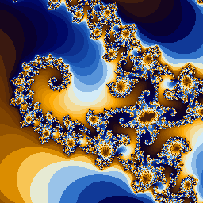
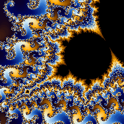

<!-- SPDX-FileCopyrightText: Copyright 2026 <balparda@github.com> & <BellaKeri@github.com> -->
<!-- SPDX-License-Identifier: Apache-2.0 -->
# tranZoom

Fractal manipulation with LLMs

- **Primary use case:** Render ultra-deep Mandelbrot fractal images with arbitrary precision, and (planned) use AI/LLMs to guide fractal zoom sequences
- **Works with:** Local filesystem (PNG output), complex-plane coordinates, AI models (future)
- **Status:** Early / experimental — core fractal engine is functional; AI guidance is planned
- **License:** Apache-2.0

**tranZoom** is a Python CLI tool for rendering the Mandelbrot set at virtually unlimited zoom depth using arbitrary-precision arithmetic (`gmpy2`). The goal is to be able to zoom so deep that standard double-precision floating point becomes meaningless — tranZoom automatically computes the required precision and renders faithfully at any scale. The long-term vision is to integrate with LLMs (via the `transai` library) to intelligently select and navigate interesting regions of the fractal automatically.

Built with:

- **Python 3.12+** with **Poetry** for dependency management
- **gmpy2** for arbitrary-precision (`mpq`/`mpfr`) complex-plane arithmetic
- **Pillow** for PNG image output
- **tqdm** for progress bars during rendering
- **transai** as the foundation for future AI/LLM integration
- **Typer** + **Rich** for the CLI and terminal output
- **Transcrypto** for CLI boilerplate, logging, hashing, and config management
- **Ruff**, **MyPy**, **Pyright**, **typeguard**, **pre-commit**, **GitHub Actions** for quality and CI

## Table of contents

- [tranZoom](#tranzoom)
  - [Table of contents](#table-of-contents)
  - [License](#license)
    - [Third-party notices](#third-party-notices)
    - [Contributions and inbound licensing](#contributions-and-inbound-licensing)
  - [Installation](#installation)
    - [Supported platforms](#supported-platforms)
    - [Known dependencies (Prerequisites)](#known-dependencies-prerequisites)
  - [Context / Problem Space](#context--problem-space)
    - [What this tool is](#what-this-tool-is)
    - [What this tool is not](#what-this-tool-is-not)
    - [Key concepts and terminology](#key-concepts-and-terminology)
    - [Inputs and outputs](#inputs-and-outputs)
      - [Inputs](#inputs)
      - [Outputs](#outputs)
  - [CLI Interface](#cli-interface)
    - [Quick start](#quick-start)
    - [Command structure](#command-structure)
    - [Global flags](#global-flags)
    - [CLI Commands Documentation](#cli-commands-documentation)
    - [`zoom image` — Render a Mandelbrot image](#zoom-image--render-a-mandelbrot-image)
    - [Comprehensive example images and zooms](#comprehensive-example-images-and-zooms)
      - [Full / Default (×1, 80 bits)](#full--default-1-80-bits)
      - [Seahorse (×155, 83 bits)](#seahorse-155-83-bits)
      - [Seahorse Tail (×3k, 88 bits)](#seahorse-tail-3k-88-bits)
      - [Satellite Antenna (×852k, 96 bits)](#satellite-antenna-852k-96-bits)
      - [Satellite Seahorse Tail with Julia Island (×4G, 108 bits)](#satellite-seahorse-tail-with-julia-island-4g-108-bits)
      - [One Island (×417G, 115 bits)](#one-island-417g-115-bits)
      - [Last Lights On (×2.5e+228, 835 bits)](#last-lights-on-25e228-835-bits)
      - [Eye of the Universe (×2.5e+1090, 3698 bits)](#eye-of-the-universe-25e1090-3698-bits)
    - [Deep zoom capability](#deep-zoom-capability)
    - [Configuration](#configuration)
    - [Color and formatting](#color-and-formatting)
    - [Exit codes](#exit-codes)
  - [Project Design](#project-design)
    - [Architecture overview](#architecture-overview)
    - [Modules / packages](#modules--packages)
    - [Performance characteristics](#performance-characteristics)
  - [Development Instructions](#development-instructions)
    - [File structure](#file-structure)
    - [Development Setup](#development-setup)
      - [Install Python](#install-python)
      - [Install Poetry (recommended: `pipx`)](#install-poetry-recommended-pipx)
      - [Make sure `.venv` is local](#make-sure-venv-is-local)
      - [Get the repository](#get-the-repository)
      - [Create environment and install dependencies](#create-environment-and-install-dependencies)
      - [Optional: VSCode setup](#optional-vscode-setup)
    - [Build](#build)
    - [Run locally](#run-locally)
    - [Testing](#testing)
      - [Unit tests / Coverage](#unit-tests--coverage)
      - [Instrumenting your code](#instrumenting-your-code)
      - [Integration / e2e tests](#integration--e2e-tests)
    - [Linting / formatting / static analysis](#linting--formatting--static-analysis)
      - [Type checking](#type-checking)
    - [Documentation updates](#documentation-updates)
    - [Versioning and releases](#versioning-and-releases)
      - [Versioning scheme](#versioning-scheme)
      - [Updating versions](#updating-versions)
        - [Bump project version (patch/minor/major)](#bump-project-version-patchminormajor)
        - [Update dependency versions](#update-dependency-versions)
        - [Exporting the `requirements.txt` file](#exporting-the-requirementstxt-file)
        - [CI and docs](#ci-and-docs)
        - [Git tag and commit](#git-tag-and-commit)
        - [Publish to PyPI](#publish-to-pypi)
  - [Security](#security)
  - [Troubleshooting](#troubleshooting)
    - [Enable debug output](#enable-debug-output)
    - [`gmpy2` installation issues](#gmpy2-installation-issues)
    - [Rendering is very slow](#rendering-is-very-slow)

## License

Copyright 2026 Daniel Balparda <balparda@github.com> & Bella Keri <BellaKeri@github.com>

Licensed under the **Apache License, Version 2.0** (the "License"); you may not use this file except in compliance with the License. You may obtain a [copy of the License here](http://www.apache.org/licenses/LICENSE-2.0).

Unless required by applicable law or agreed to in writing, software distributed under the License is distributed on an "AS IS" BASIS, WITHOUT WARRANTIES OR CONDITIONS OF ANY KIND, either express or implied. See the License for the specific language governing permissions and limitations under the License.

### Third-party notices

This project includes or depends on third-party software (see `requirements.txt` and `pyproject.toml`). Key dependencies include:

- [gmpy2](https://gmpy2.readthedocs.io/) — Apache-2.0 compatible
- [Pillow](https://python-pillow.github.io/) — HPND license
- [tqdm](https://github.com/tqdm/tqdm) — MPL-2.0 / MIT
- [transai](https://github.com/balparda/transai) — Apache-2.0
- [transcrypto](https://github.com/balparda/transcrypto) — Apache-2.0

### Contributions and inbound licensing

Contributions are accepted under the Apache-2.0 license (same as project).

## Installation

To install from PyPI:

```sh
pip3 install tranzoom
```

Or install from the repository for development (see [Development Setup](#development-setup)).

### Supported platforms

- OS: Linux, macOS
- Architectures: x86_64, arm64
- Python: 3.12, 3.13, 3.14

### Known dependencies (Prerequisites)

- **[python 3.12+](https://python.org/)** — [documentation](https://docs.python.org/3.12/)
- **[gmpy2 2.3+](https://pypi.org/project/gmpy2/)** — Arbitrary-precision arithmetic using GMP/MPFR/MPC — [documentation](https://gmpy2.readthedocs.io/en/latest/)
- **[Pillow 12+](https://pypi.org/project/Pillow/)** — PNG image generation — [documentation](https://pillow.readthedocs.io/)
- **[tqdm 4.67+](https://pypi.org/project/tqdm/)** — Progress bars — [documentation](https://tqdm.github.io/)
- **[rich 14.2+](https://pypi.org/project/rich/)** — Terminal formatting — [documentation](https://rich.readthedocs.io/en/latest/)
- **[typer 0.21+](https://pypi.org/project/typer/)** — CLI parser — [documentation](https://typer.tiangolo.com/)
- **[transai 1.2+](https://pypi.org/project/transai/)** — AI integration foundation — [documentation](https://github.com/balparda/transai)
- **[transcrypto 2.1+](https://pypi.org/project/transcrypto/)** — CLI utilities, logging, hashing, config — [documentation](https://github.com/balparda/transcrypto)

## Context / Problem Space

### What this tool is

tranZoom is a command-line fractal renderer focused on extreme zoom depth. Standard double-precision (`float64`) floating point has only about 15–16 significant decimal digits, so any zoom below roughly 1e-14 of the full Mandelbrot set will produce incorrect images due to precision loss. tranZoom uses `gmpy2.mpq` (exact rational arithmetic) to represent frame coordinates and `gmpy2.mpfr` (arbitrary-precision floating point) for the escape-time computations, automatically determining how many bits of precision are needed for any given zoom level.

The long-term vision is to use LLMs to autonomously guide the zoom — identifying interesting regions, proposing successive frames, and building navigated zoom sequences without manual coordinate discovery.

### What this tool is not

- Not a real-time / interactive fractal explorer (rendering is intentionally CPU-intensive for correctness at depth)
- Not limited to a fixed precision (unlike most other fractal tools, which cap at `float64`)
- Not yet AI-guided (that is the planned future direction)

### Key concepts and terminology

- **Frame**: A rectangular region of the complex plane, defined by two corners or a center + width. Stored as `gmpy2.mpq` (exact rationals) to avoid any accumulation of rounding error in coordinates.
- **Precision**: The number of bits of `mpfr` floating-point precision used for escape-time iteration. Computed automatically from the frame size; never needs to be set manually.
- **Magnification**: Ratio of the default full-set frame area to the current frame area. 1× = full set; 1G× = zoomed in one billion times.
- **Escape-time iteration**: The core Mandelbrot test; larger `max_iter` produces more detail at high zoom.
- **Interior tests**: Fast algebraic checks (main cardioid, period-2 bulb) that skip the iterative test for points known to be inside the set, speeding up rendering significantly.

### Inputs and outputs

#### Inputs

- stdin: not used
- CLI arguments: center coordinates (real + imaginary parts as strings, for exact `mpq` conversion), frame width/height, output image dimensions
- Config file: stored in the OS-native location via `transcrypto.utils.config`

#### Outputs

- stdout: progress info and saved filename
- stderr: warnings/errors/logs (controlled by `--verbose`)
- Output images are saved as `mandel-<YYYYMMDDHHMMSS>-<SHA256-20>.png` or `mandel-<YYYYMMDDHHMMSS>-<SHA256-20>.png`, depending on `--date/--no-date` flag, to a directory chosen by the user, `-o/--out` flag

## CLI Interface

### Quick start

Render the [full Mandelbrot set](#full--default-1-80-bits) (default, 1024×1024):

```sh
$ poetry run zoom image

1024x1024 Mandelbrot in frame [(-3/4, 0) @ 5/2], precision 80 bits, 1 magnification, 1000 iterations...

Img: 100%|█████████████████████████████████████████████| 1024/1024 [00:13<00:00, 74.30ln/s]

Generated image '64bc99945eadee05f4f68deead541f6a3c0ecffd653e97a05c7b52dc2a693bf9' in 14.344 s
Saved to 'tests/data/images/mandel-64bc99945eadee05f4f6.png'
```

As can be seen, the `Frame` is stored as rational numbers with arbitrary precision, `[(-3/4, 0) @ 5/2]`, so it is guaranteed to be exact (centered in $-0.75+0j$ and with width of $2.5$). It will pick a precision, in bits, which is the internal `float` representation (matissa), and will pick the (max) number of iterations for the generation. The magnification here is 1 because it is the full Mandelbrot set. There will be a progress bar, counting the horizontal lines being produced. The generated image data will be hashed and then saved to a PNG on disk.


Render a 512×512 [well-known zoom ("Seahorse", ~155× magnification, 512×512)](#seahorse-155-83-bits):

```sh
poetry run zoom -w 512 -h 512 image " -0.74303" "0.126433" "0.01611"
```


Render an extreme 256×256 [zoom ("Satellite Seahorse Tail with Julia Island", ~4 billion× magnification)](#satellite-seahorse-tail-with-julia-island-4g-108-bits):

```sh
poetry run zoom -w 256 -h 256 image " -0.74364388717342" "0.13182590425182" "0.00000000059849"
```



### Command structure

```sh
zoom [global flags] <command> [args]
```

### Global flags

| Flag | Description | Default |
| --- | --- | --- |
| `--help` | Show help | off |
| `--version` | Show version and exit | off |
| `-v`, `-vv`, `-vvv`, `--verbose` | Verbosity (nothing=*ERROR*, `-v`=*WARNING*, `-vv`=*INFO*, `-vvv`=*DEBUG*) | *ERROR* |
| `--color`/`--no-color` | Force enable/disable colored output (respects `NO_COLOR` env var if not provided) | `--color` |
| `-w`/`--width` | Output image width in pixels (4–8192) | 1024 |
| `-h`/`--height` | Output image height in pixels (4–8192) | 1024 |

### CLI Commands Documentation

Auto-generated CLI reference: [**`zoom` documentation**](zoom.md)

### `zoom image` — Render a Mandelbrot image

```sh
zoom [-w WIDTH] [-h HEIGHT] image [CENTER_RE] [CENTER_IM] [F_WIDTH] [F_HEIGHT]
```

Arguments (all optional; defaults show the full Mandelbrot set):

| Argument | Description | Default |
| --- | --- | --- |
| `CENTER_RE` | Real part of the center point (string, for exact precision) | `'-0.75'` |
| `CENTER_IM` | Imaginary part of the center point (string, for exact precision) | `'0'` |
| `F_WIDTH` | Width of the frame in the real plane | `'2.5'` |
| `F_HEIGHT` | Height of the frame in the imaginary plane | same as `F_WIDTH` |

The command:

1. Constructs a `Frame` from the given coordinates using `gmpy2.mpq` exact arithmetic
2. Calculates the required `mpfr` precision automatically based on zoom depth
3. Scales `max_iter` logarithmically with magnification
4. Renders all pixels using the escape-time algorithm (with cardioid/bulb interior shortcuts)
5. Saves the PNG to `mandel-<YYYYMMDDHHMMSS>-<hash12>.png` in the working directory

See below for many example outputs.

### Comprehensive example images and zooms

You can run all these at once by executing `scripts/make_examples.sh`.

#### Full / Default (×1, 80 bits)

Render the full [Mandelbrot set](https://en.wikipedia.org/wiki/Mandelbrot_set) with all the default values (image size 1024×1024, centered in $-0.75+0j$ and with width of $2.5$, a good frame that contains the whole set):

```sh
$ poetry run zoom image

1024x1024 Mandelbrot in frame [(-3/4, 0) @ 5/2], precision 80 bits, 1 magnification, 1000 iterations...

Img: 100%|█████████████████████████████████████████████| 1024/1024 [00:13<00:00, 74.30ln/s]

Generated image '64bc99945eadee05f4f68deead541f6a3c0ecffd653e97a05c7b52dc2a693bf9' in 14.344 s
Saved to 'tests/data/images/mandel-64bc99945eadee05f4f6.png'
```

This is what tranZoom considers ***"1 magnification"***, and will measure other magnifications against this size.


#### Seahorse (×155, 83 bits)

Render a [well-known zoom ("Seahorse")](https://en.wikipedia.org/wiki/File:Mandel_zoom_03_seehorse.jpg) to a 512×512 image:

```sh
$ poetry run zoom -w 512 -h 512 image " -0.74303" "0.126433" "0.01611"

512x512 Mandelbrot in frame [(-74303/100000, 126433/1000000) @ 1611/100000], precision 83 bits, 155.183 magnification, 1876 iterations...

Img: 100%|█████████████████████████████████████████████| 512/512 [00:30<00:00, 16.77ln/s]

Generated image '411d8a9f5d35c761badcabc61b09abfcecf943e32fd8bebc473c16bd324db240' in 30.687 s
Saved to 'tests/data/images/mandel-411d8a9f5d35c761badc.png'
```


#### Seahorse Tail (×3k, 88 bits)

Render a ["Seahorse Tail"](https://en.wikipedia.org/wiki/File:Mandel_zoom_05_tail_part.jpg) to a 512×512 image:

```sh
$ poetry run zoom -w 512 -h 512 image " -0.7436499" "0.13188204" "0.00073801"

512x512 Mandelbrot in frame [(-7436499/10000000, 3297051/25000000) @ 73801/100000000], precision 88 bits, 3.387 k magnification, 2411 iterations...

Img: 100%|█████████████████████████████████████████████| 512/512 [00:11<00:00, 43.04ln/s]

Generated image '826ee9edaa3cde78059cee02a74faf361e5f2e2da62e44d46b0da9dab1f592f7' in 12.085 s
Saved to 'tests/data/images/mandel-826ee9edaa3cde78059c'
```


#### Satellite Antenna (×852k, 96 bits)

Render a ["Satellite Antenna"](https://en.wikipedia.org/wiki/File:Mandel_zoom_08_satellite_antenna.jpg) to a 256×256 image:

```sh
$ poetry run zoom -w 256 -h 256 image " -0.743644786" "0.1318252536" "0.0000029336"

256x256 Mandelbrot in frame [(-371822393/500000000, 164781567/1250000000) @ 3667/1250000000], precision 96 bits, 852.195 k magnification, 3372
iterations...

Img: 100%|█████████████████████████████████████████████| 256/256 [00:30<00:00,  8.30ln/s]

Generated image 'f521ad3bf2644a5f3255a297a5a3bf68f94376f01ea0097b0b1a0d2c8865a9c5' in 30.890 s
Saved to 'tests/data/images/mandel-f521ad3bf2644a5f3255.png'
```



#### Satellite Seahorse Tail with Julia Island (×4G, 108 bits)

Render a ["Satellite Seahorse Tail with Julia Island"](https://en.wikipedia.org/wiki/File:Mandel_zoom_13_satellite_seehorse_tail_with_julia_island.jpg) to a 256×256 image:

```sh
$ poetry run zoom -w 256 -h 256 image " -0.74364388717342" "0.13182590425182" "0.00000000059849"

256x256 Mandelbrot in frame [(-37182194358671/50000000000000, 6591295212591/50000000000000) @ 59849/100000000000000], precision 108 bits, 4.177 G
magnification, 4848 iterations...

Img: 100%|█████████████████████████████████████████████| 256/256 [00:32<00:00,  7.87ln/s]

Generated image '34166c6d5db640bfa3996aeaa9f1d2f969d3942359dbe0f42014c93c06276a47' in 32.604 s
Saved to 'tests/data/images/mandel-34166c6d5db640bfa399.png'
```


#### One Island (×417G, 115 bits)

Render an ["One Island"](https://commons.wikimedia.org/wiki/File:Mandel_zoom_15_one_island.jpg) to a 256×256 image:

```sh
$ poetry run zoom -w 256 -h 256 image " -0.743643887036" "0.13182590421" "0.000000000006"

256x256 Mandelbrot in frame [(-185910971759/250000000000, 13182590421/100000000000) @ 3/500000000000], precision 115 bits, 416.667 G magnification, 5647
iterations...

Img: 100%|█████████████████████████████████████████████| 256/256 [01:20<00:00,  3.18ln/s]

Generated image 'ec687adf4c237e2cf2cc750a5d430a32a8a6b9913aae9e258840b3f8fab74a22' in 1.342 min
Saved to 'tests/data/images/mandel-ec687adf4c237e2cf2cc.png'
```


#### Last Lights On (×2.5e+228, 835 bits)

Render a ["Last Lights On"](https://youtu.be/foxD6ZQlnlU) ultra-deep zoom to a 64×64 image:

```sh
$ poetry run zoom -w 64 -h 64 image " -1.7685736563152709932817429153295447129341200534055498823375111352827765533646353820119779335363321986478087958745766432300344486098206084588445291690832853792608335811319613234806674959498380432536269122404488847453646628324959064543" " -0.0009642968513582800001762427203738194482747761226565635652857831533070475543666558930286153827950716700828887932578932976924523447497708248894734256480183898683164582055541842171815899305250842692638349057118793296768325124255746563" "0.000000000000000000000000000000000000000000000000000000000000000000000000000000000000000000000000000000000000000000000000000000000000000000000000000000000000000000000000000000000000000000000000000000000000000000000000000000000001"

64x64 Mandelbrot in frame [...], precision 835 bits, 2.500000e+228 magnification, 92359 iterations...

Img: 100%|█████████████████████████████████████████████| 64/64 [05:10<00:00,  4.86s/ln]

Generated image 'f3cc103136423a57975750907ebc1d367e2985ac6338976d4d5a439f50323f4a' in 5.184 min
Saved to 'tests/data/images/mandel-f3cc103136423a579757.png'
```


TODO: **THIS IS STILL WORK IN PROGRESS**

#### Eye of the Universe (×2.5e+1090, 3698 bits)

Render an ["Eye of the Universe"](https://youtu.be/pCpLWbHVNhk) extra-ultra-deep zoom to a 64×64 image:

```sh
poetry run zoom -w 64 -h 64 image "0.360240443437614363236125244449545308482607807958585750488375814740195346059218100311752936722773426396233731729724987737320035372683285317664532401218521579554288661726564324134702299962817029213329980895208036363104546639698106204384566555001322985619004717862781192694046362748742863016467354574422779443226982622356594130430232458472420816652623492974891730419252651127672782407292315574480207005828774566475024380960675386215814315654794021855269375824443853463117354448779647099224311848192893972572398662626725254769950976527431277402440752868498588785436705371093442460696090720654908973712759963732914849861213100695402602927267843779747314419332179148608587129105289166676461292845685734536033692577618496925170576714796693411776794742904333484665301628662532967079174729170714156810530598764525260869731233845987202037712637770582084286587072766838497865108477149114659838883818795374195150936369987302574377608649625020864292915913378927790344097552591919409137354459097560040374880346637533711271919419723135538377394364882968994646845930838049998854075817859391340445151448381853615103761584177161812057928" " -0.64131306106480317486037501517930206657949495228230525955617754306444857417275369025563702306896811623707405655370721497901069732111052737408519933948032874376062385962622877310759994839404671612888406145810912943257099889922691650073943057326832083188346723669475507109200885016557042523852444811688364262770522325934129814722379683536614777935303366072477389516258177554010650453622730397883322455673450616657567086893592945166682714405252736530837178777012377561442143948702455985908839737165316911242866695528036404140685233252768089090403176170926838265215015399323972620120110820987219446431186950012260489774300385094701017155554390478847520583348048913896855309461126215734165824829262218047674662583460144179343561498373520926088916390727459306393646935132167191145233289906900695886760879236566576560237944843247975460242483281565864716626310087413490699614938176001001334397215579692632211850959512414914087567515824713075373828279240737467608840817048879020400360566114013787859524521050992424992410032080134608784429534086481786923537881537872299402216117310344052035199453139116273149008518510721229904925" "0.0000000000000000000000000000000000000000000000000000000000000000000000000000000000000000000000000000000000000000000000000000000000000000000000000000000000000000000000000000000000000000000000000000000000000000000000000000000000000000000000000000000000000000000000000000000000000000000000000000000000000000000000000000000000000000000000000000000000000000000000000000000000000000000000000000000000000000000000000000000000000000000000000000000000000000000000000000000000000000000000000000000000000000000000000000000000000000000000000000000000000000000000000000000000000000000000000000000000000000000000000000000000000000000000000000000000000000000000000000000000000000000000000000000000000000000000000000000000000000000000000000000000000000000000000000000000000000000000000000000000000000000000000000000000000000000000000000000000000000000000000000000000000000000000000000000000000000000000000000000000000000000000000000000000000000000000000000000000000000000000000000000000000000000000000000000000000000000000000000000000000000000000000000000000000000000000000000000000000000000000000000000001"
```


TODO: **THIS IS STILL WORK IN PROGRESS**

### Deep zoom capability

tranZoom supports zoom levels far beyond what standard floating point can represent. A few examples and their required precision:

| Magnification | Approx. scale | Bits needed | Example |
| --- | --- | --- | --- |
| 1× | 2.5 (full set) | 80 | Default view |
| 155× | ~0.016 | 83 | Seahorse valley |
| 3.4k× | ~7e-4 | 88 | Seahorse tail |
| 850k× | ~3e-9 | 96 | Satellite antenna |
| 4.2G× | ~6e-10 | 108 | Satellite seahorse tail |
| 417G× | ~6e-12 | 115 | One island |
| ~10^230× | ~10^-231 | ~835 | Deep in the set |

The `precision` property of a `Frame` automatically computes the required bits, and `gmpy2.local_context()` ensures all floating-point operations in `Mandelbrot()` use that precision. Maximum supported precision is 300,000 bits (~100k decimal digits).

### Configuration

Config files are stored in OS-native locations via `transcrypto.utils.config`:

- macOS: `~/Library/Application Support/tranzoom/config.bin`
- Linux: `~/.config/tranzoom/config.bin`
- Windows: `%APPDATA%\tranzoom\config.bin`

### Color and formatting

The CLI respects the `NO_COLOR` environment variable and the `--no-color` / `--color` flag. Rich markup is used for console output — see [Rich markup conventions](https://rich.readthedocs.io/en/latest/markup.html).

### Exit codes

| Code | Meaning |
| --- | --- |
| 0 | Success |
| 1 | Generic failure |
| 2 | CLI usage error (bad arguments) |

## Project Design

### Architecture overview

```txt
zoom CLI (zoom.py: Main callback, global options, TranZoomConfig)
    └── zoom image (cli/imagecommand.py)
            └── fractal.Frame + fractal.Mandelbrot() (core/fractal.py)
                    ├── gmpy2 mpq — exact coordinate representation
                    ├── gmpy2 mpfr — arbitrary-precision escape-time math
                    └── Pillow — PNG image output
```

### Modules / packages

| Component | Responsibility |
| --- | --- |
| `zoom.py` | CLI entry point (`app`, `Main`, `TranZoomConfig`) |
| `cli/base.py` | Shared CLI options, defaults, `DEFAULT_FRAME` |
| `cli/imagecommand.py` | `zoom image` command implementation |
| `core/fractal.py` | `Frame` class and `Mandelbrot()` renderer — all fractal math |
| `utils/template.py` | Template for new utility modules |

### Performance characteristics

Rendering is CPU-bound. Time scales roughly with `width × height × max_iter × precision_overhead`. For deep zooms, higher precision means slower `mpfr` arithmetic (roughly linear in the number of bits). For very deep zooms (>100 bits precision), rendering a 256×256 image at 50k iterations can take minutes to hours. The `tqdm` progress bar shows per-row speed.

The `Mandelbrot()` function pre-computes all X-axis `mpfr` values once per image and reuses them across rows, which is an important optimization since `mpfr` construction is expensive at high precision.

## Development Instructions

### File structure

```txt
.
├── CHANGELOG.md                  ⟸ latest changes/releases
├── LICENSE
├── Makefile
├── zoom.md                       ⟸ auto-generated CLI doc (by `make docs` or `make ci`)
├── poetry.lock                   ⟸ maintained by Poetry; do not manually edit
├── pyproject.toml                ⟸ most important configurations live here
├── README.md                     ⟸ this documentation
├── SECURITY.md                   ⟸ security policy
├── requirements.txt
├── .editorconfig
├── .gitignore
├── .pre-commit-config.yaml       ⟸ pre-submit configs
├── .github/
│   ├── copilot-instructions.md
│   ├── dependabot.yaml
│   └── workflows/
│       ├── ci.yaml
│       └── codeql.yaml
├── .vscode/
│   ├── extensions.json
│   └── settings.json
├── scripts/
│   └── template.py               ⟸ template for standalone executable scripts
├── src/
│   └── tranzoom/
│       ├── __init__.py           ⟸ version lives here
│       ├── __main__.py
│       ├── zoom.py               ⟸ main CLI entry point (Main, TranZoomConfig)
│       ├── py.typed
│       ├── cli/
│       │   ├── __init__.py
│       │   ├── base.py           ⟸ shared CLI options and frame defaults
│       │   └── imagecommand.py   ⟸ `zoom image` command implementation
│       ├── core/
│       │   ├── __init__.py
│       │   └── fractal.py        ⟸ Frame class and Mandelbrot() renderer
│       └── utils/
│           ├── __init__.py
│           └── template.py       ⟸ template for new utility modules
├── tests/
│   ├── zoom_test.py
│   └── cli/
│       └── imagecommand_test.py
└── tests_integration/
    └── test_installed_cli.py
```

### Development Setup

#### Install Python

On **Linux**:

```sh
sudo apt-get update && sudo apt-get upgrade
sudo apt-get install git python3 python3-dev python3-venv build-essential software-properties-common
sudo add-apt-repository ppa:deadsnakes/ppa && sudo apt-get update
sudo apt-get install python3.12  # or python3.13 or python3.14
```

On **macOS**:

```sh
brew update && brew upgrade && brew cleanup -s
brew install git python@3.12  # or python3.13 or python3.14
```

Note: `gmpy2` requires the GMP, MPFR, and MPC C libraries. On macOS: `brew install gmp mpfr mpc`. On Linux: `sudo apt-get install libgmp-dev libmpfr-dev libmpc-dev`.

#### Install Poetry (recommended: `pipx`)

[Poetry reference.](https://python-poetry.org/docs/cli/)

```sh
python3 -m pip install --user pipx
python3 -m pipx ensurepath
pipx install poetry
poetry --version
```

If you will use [PyPI](https://pypi.org/) to publish:

```sh
poetry config pypi-token.pypi <TOKEN>
```

#### Make sure `.venv` is local

```sh
poetry config virtualenvs.in-project true
```

#### Get the repository

```sh
git clone https://github.com/balparda/tranzoom.git
cd tranzoom
```

#### Create environment and install dependencies

```sh
poetry env use python3.12   # creates the .venv with the correct Python version
poetry sync                  # install all dependencies from poetry.lock
poetry env info              # verify environment
poetry run zoom --help       # smoke test
make ci                      # should pass on clean repo
```

To activate the environment:

```sh
source .venv/bin/activate
# ... work ...
deactivate
```

#### Optional: VSCode setup

This repo ships a `.vscode/settings.json` configured to use `./.venv/bin/python`, run `pytest`, format with Ruff, and use Google-style docstrings. Recommended extensions:

- Python (`ms-python.python`)
- Python Environments (`ms-python.vscode-python-envs`)
- Python Debugger (`ms-python.debugpy`)
- Pylance (`ms-python.vscode-pylance`)
- Mypy Type Checker (`ms-python.mypy-type-checker`)
- Ruff (`charliermarsh.ruff`)
- autoDocstring (`njpwerner.autodocstring`)
- Code Spell Checker (`streetsidesoftware.code-spell-checker`)
- markdownlint (`davidanson.vscode-markdownlint`)
- Markdown All in One (`yzhang.markdown-all-in-one`)
- GitHub Copilot (`github.copilot`)

### Build

```sh
poetry build   # builds wheel + sdist in dist/
```

### Run locally

```sh
poetry run zoom --help
poetry run zoom image                                          # full set, 1024×1024
poetry run zoom -w 512 -h 512 image "-0.74303" "0.126433" "0.01611"  # seahorse valley
```

### Testing

#### Unit tests / Coverage

```sh
make test               # plain test run (no integration tests)
make integration        # run the integration tests
poetry run pytest -vvv  # verbose

make cov  # coverage: poetry run pytest --cov=src --cov-report=term-missing
```

Test tags defined in `pyproject.toml`:

| Tag | Meaning |
| --- | --- |
| `slow` | test takes > 1s |
| `flaky` | known flaky test — avoid |
| `stochastic` | may fail with very low probability |

Filter by tag:

```sh
poetry run pytest -vvv -m slow
```

Find slow tests:

```sh
poetry run pytest -vvv -q --durations=20
```

Find flaky tests:

```sh
make flakes  # runs all tests 100 times
```

#### Instrumenting your code

```sh
source .venv/bin/activate
pyinstrument -r html -o profile.html -- $(which zoom) image "-0.74303" "0.126433" "0.01611"
deactivate
```

#### Integration / e2e tests

Integration tests build a wheel, install it into a fresh temporary virtualenv, and run the console scripts. Run with:

```sh
make integration
# or:
poetry run pytest -m integration -q
```

### Linting / formatting / static analysis

```sh
make lint  # poetry run ruff check .
make fmt   # poetry run ruff format .

poetry run ruff format --check .  # check formatting without rewriting
```

#### Type checking

```sh
make type  # poetry run mypy src tests tests_integration
```

### Documentation updates

CLI reference is auto-generated from the CLI source code:

```sh
make docs  # regenerates zoom.md
# or:
poetry run zoom markdown > zoom.md
```

Always run `make ci` before committing — it runs linting, type checking, tests, and regenerates docs and `requirements.txt`.

### Versioning and releases

#### Versioning scheme

- **Patch**: bug fixes / docs / small improvements.
- **Minor**: new features or non-breaking changes.
- **Major**: breaking changes (command renames, incompatible output formats).

See: [CHANGELOG.md](CHANGELOG.md)

#### Updating versions

##### Bump project version (patch/minor/major)

```sh
poetry version minor   # 1.0.0 → 1.1.0
poetry version patch   # 1.0.0 → 1.0.1
poetry version 1.2.3   # explicit version
```

**Also update `src/tranzoom/__init__.py` to match!**

##### Update dependency versions

```sh
poetry update                      # update poetry.lock to latest compatible versions
poetry cache clear PyPI --all      # if cache issues
poetry add "pkg>=1.2.3"            # add prod dependency
poetry add -G dev "pkg>=1.2.3"     # add dev dependency
```

##### Exporting the `requirements.txt` file

```sh
make req  # poetry export --format requirements.txt --without-hashes --output requirements.txt
```

##### CI and docs

```sh
make ci  # runs lint, type check, tests, docs, requirements — do this before every commit
```

##### Git tag and commit

```sh
git commit -a -m "release version 1.0.0"
git tag 1.0.0
git push && git push --tags
```

##### Publish to PyPI

```sh
poetry config pypi-token.pypi <TOKEN>  # once, if not already configured
poetry build
poetry publish
```

## Security

Please refer to the security policy in [SECURITY.md](SECURITY.md) for supported versions and how to report vulnerabilities.

The project uses [**CodeQL**](https://codeql.github.com/docs/) (weekly + on every push) and [**dependabot**](https://docs.github.com/en/code-security/tutorials/secure-your-dependencies/dependabot-quickstart-guide) (weekly dependency updates) to keep the codebase secure and up-to-date.

## Troubleshooting

### Enable debug output

```sh
zoom -vvv image ...   # DEBUG level logging
```

### `gmpy2` installation issues

On macOS, `gmpy2` requires the GMP, MPFR, and MPC C libraries. Install them first:

```sh
brew install gmp mpfr mpc
poetry sync
```

On Linux:

```sh
sudo apt-get install libgmp-dev libmpfr-dev libmpc-dev
poetry sync
```

### Rendering is very slow

- Reduce image size: `zoom -w 256 -h 256 image ...`
- `max_iter` is auto-scaled with zoom depth; very deep zooms are inherently slow
- Very high precision (> 1000 bits, i.e., zoom > ~10^300) will always be slow — this is expected

---

Thanks! *Daniel Balparda & Bella Keri*
